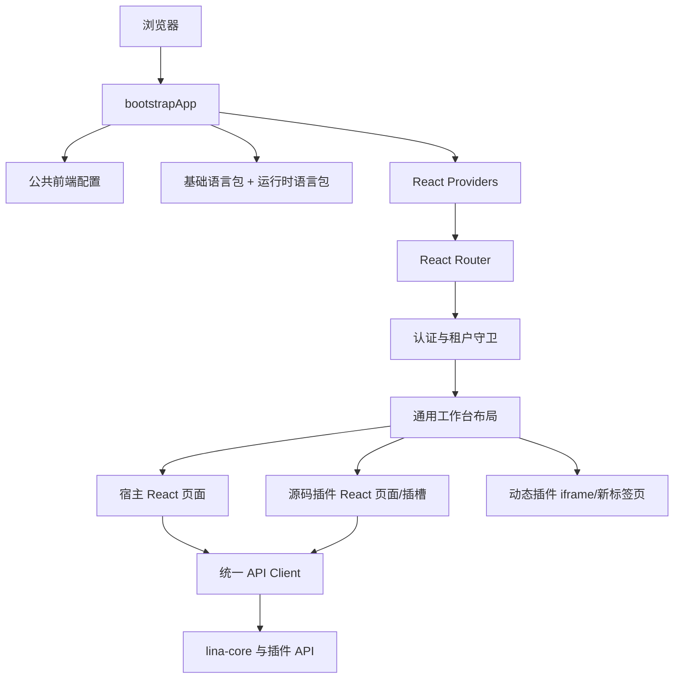
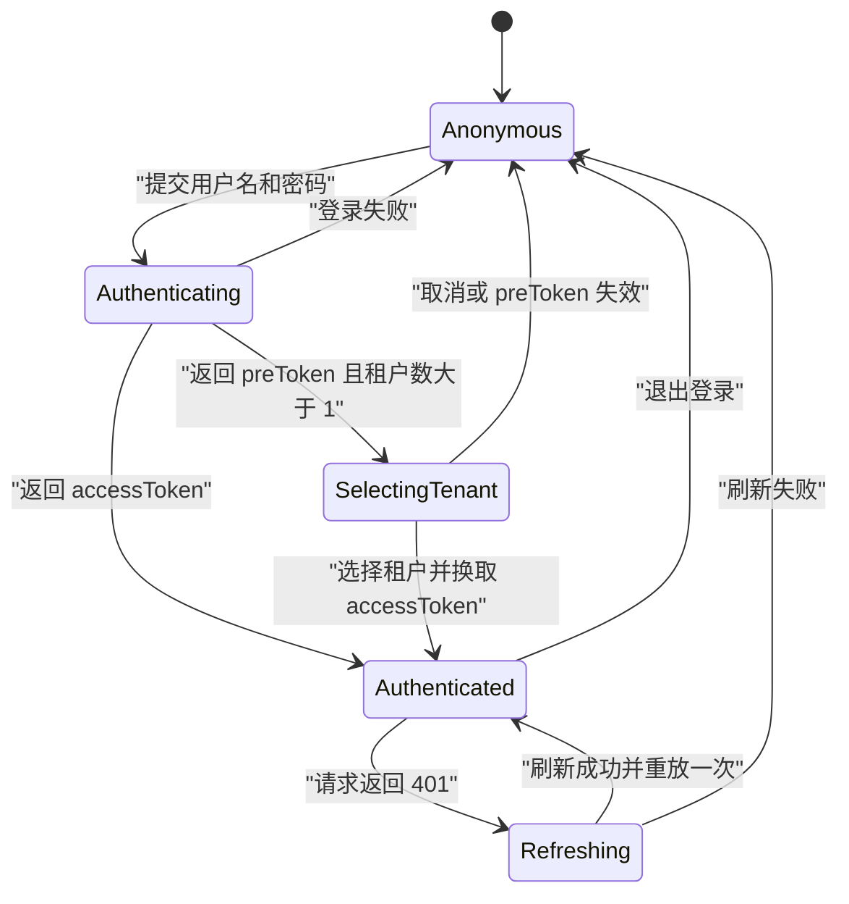
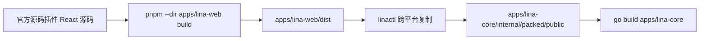

# LinaPro React 工作台替换详细设计

## 文档定位

本文定义使用`apps/lina-web`替换`apps/lina-vben`的详细设计。目标读者是 LinaPro 宿主、工作台、官方源码插件、构建工具和测试维护者。读者应了解 React、Vite、LinaPro 菜单权限模型和源码插件目录约定。

本文只设计 LinaPro 通用工作台及其插件 UI 接缝，不迁移 TapCanvas 领域页面，不实现`FlowMutation`、生成任务或 Agents Bridge。TapCanvas 前端将在工作台和插件 UI 契约稳定后，由`linapro-tapcanvas-studio`迁移计划接入。

上位约束来自`docs/2026-07-11-tapcanvas-react-platform-migration-design.md`：工作台、内建页面和官方源码插件统一使用 React；LinaPro 继续拥有认证、用户、租户、RBAC、数据权限和插件治理；迁移完成后删除 Vue/Vben 路径，不保留兼容层。

本设计的执行顺序由已冻结的`docs/2026-07-12-react-workbench-replacement-tasklist.md` `v1.2`控制。代码库对照证据和修订记录见`docs/2026-07-12-react-workbench-tasklist-v1-executability-review.md`。

## 结论

新建单包应用`apps/lina-web`，以 React 19、TypeScript、Vite、React Router、TanStack Query、Zustand、Semi Design 和 i18next 重建 LinaPro 通用工作台。实施期间允许两个源码目录暂时共存，但默认开发、构建和交付入口只在最终切换时一次性从`apps/lina-vben`改到`apps/lina-web`。

替换采用以下边界：

- 后端认证、菜单、用户、租户和业务 API 保持现有 LinaPro 契约，前端通过新的类型化适配层消费。
- 宿主内建页面统一使用 Semi Design，以`Table`、`Form`、`SideSheet`和`Modal`承载管理工作台交互。
- 宿主生产依赖不得包含`antd`、`@ant-design/icons`或其他 Ant Design React 包，不建立 Semi/Ant 双组件层。
- TapCanvas 等源码插件可继续使用自己的 React 组件库，但不得引入第二份 React 运行时。
- 源码插件通过`frontend/plugin-ui.ts`贡献 React 懒加载页面和插槽。
- 源码插件 React 页面发现完全归`apps/lina-web`构建期负责，`lina-core`不扫描`.tsx`、不解析 React 模块，也不感知 Semi Design。
- 动态插件只允许`iframe`或新标签页隔离运行，不再允许 ESM `embedded-mount`注入宿主运行时；需要受保护 API 的 iframe 通过宿主受限消息桥接访问，不能获得 LinaPro Token。
- 最终删除`apps/lina-vben`、Vue/Vben 专属规则、依赖、扫描器、CI 路径和进程名称。

## 范围与非目标

### 本次范围

- `apps/lina-web`应用启动、公共配置、布局、主题、路由、标签、错误边界和响应式导航。
- LinaPro 登录、Token 刷新、退出、当前用户、权限码、租户选择、租户切换和平台代入。
- 动态菜单、按钮权限、模块能力隐藏和插件状态刷新。
- Dashboard、API Docs、系统信息、个人中心和当前全部系统管理页面。
- 源码插件 React 页面、React 插槽、运行时 i18n 和插件 generation 刷新契约。
- 动态插件`iframe`/新标签页隔离页面。
- 根构建、`linactl`、资源嵌入、i18n 扫描、CI 和 E2E 切换。
- Vue/Vben 工作台及其专属依赖的最终删除。

### 非目标

- 不修改 LinaPro 用户、角色、菜单、租户和数据权限的业务语义。
- 不为了前端展示重塑`lina-core`领域模型或数据库表。
- 不迁移 TapCanvas 业务 API、画布状态和 Hono 逻辑。
- 不引入微前端框架、Module Federation、Vue/React 适配器或双运行时桥接。
- 不复刻 Vben 内部抽象，例如 schema 驱动的通用表格、表单、Modal 和 Drawer 框架。
- 不继续支持动态插件的`embedded-mount`模式。
- 不在本次替换中升级无关的后端依赖或重做管理工作台信息架构。

## 现状基线

当前`apps/lina-vben`是 Vben 5.6.0 派生的 pnpm monorepo，主应用位于`apps/lina-vben/apps/web-antd`。仓库中约有 90 个 Vue 文件、122 个 TypeScript 文件和 13 个前端单元测试。默认构建将`apps/web-antd/dist`复制到`apps/lina-core/internal/packed/public`。

当前工作台承担以下不可丢失的宿主行为：

| 能力 | 当前入口 | 替换要求 |
| --- | --- | --- |
| 登录与刷新 | `/auth/login`、`/auth/refresh` | 保持多租户预登录和单飞刷新 |
| 用户上下文 | `/user/info` | 保持权限码、角色和首页投影 |
| 动态菜单 | `/menus/all` | 保持后端菜单、隐藏项和 iframe 元数据 |
| 租户上下文 | `X-Tenant-Code` | 保持选择、切换、平台代入和回退路由 |
| 运行时 i18n | `/i18n/runtime/*` | 保持 ETag、本地缓存和插件资源刷新 |
| 公共前端配置 | `/config/public/frontend` | 保持品牌、主题、工作台根路径和 cron 投影 |
| 源码插件 UI | Vite 扫描`frontend/pages/**/*.vue`和`frontend/slots/**/*.vue` | 改为显式 React 懒加载清单 |
| 动态插件 UI | iframe、新标签页、`embedded-mount` | 仅保留 iframe 和新标签页；iframe 通过受限消息桥接保持受保护 API 能力 |
| 热升级 | 插件状态 generation 检测 | 保持当前插件页定向刷新，不干扰其他页面 |

根`Makefile`、`hack/tools/linactl`、`hack/tests`、多个 GitHub Actions workflow 和`lina-core`仓库根识别逻辑均硬编码`apps/lina-vben`。这些路径属于替换范围，不能只修改前端目录。

## 技术基线

本次替换固定以下基线，避免同时升级整个仓库工具链：

| 类别 | 选择 | 版本或约束 |
| --- | --- | --- |
| Node.js | 仓库统一运行时 | `22.22.0` |
| pnpm | 包管理器 | `10.30.3` |
| TypeScript | 静态类型 | `5.9.3` |
| React | 唯一宿主 UI 运行时 | `19.2.7` |
| Vite | 开发与构建 | `7.3.1` |
| Vite React 插件 | React Fast Refresh 和 JSX 转换 | `@vitejs/plugin-react@5.2.0` |
| React Router | Browser Router 与动态路由投影 | `7.18.1` |
| TanStack Query | 服务端状态、缓存和失效 | `5.101.2` |
| Zustand | 会话、租户和本地偏好 | `5.0.14` |
| Semi Design | 宿主管理页面组件库 | `@douyinfe/semi-ui@2.101.0` |
| Semi Icons | 宿主图标组件库 | `@douyinfe/semi-icons@2.101.0` |
| i18next | 宿主与插件运行时多语言 | `26.3.6` |
| react-i18next | React 绑定 | `17.0.9` |
| Vitest | 单元与组件测试 | `4.0.18` |
| ECharts | Dashboard 图表 | `6.0.0` |
| TipTap React | 通知公告富文本 | `2.27.2` |
| cropperjs | 头像裁剪 | `1.6.2` |
| dayjs | 日期时间显示 | `1.11.19` |
| Playwright | 仓库 E2E | 保持`hack/tests`现有锁定版本 |

选择 Semi Design 是为了获得更轻、更克制的后台视觉语言，同时保留表格、表单、侧滑面板和弹窗等完整管理组件。宿主页面直接使用 Semi Design，不增加通用 UI 适配层。源码插件不强制使用 Semi Design，但必须使用宿主 React peer dependency，并将自身样式限制在插件根容器内。

现有交互迁移到 Semi Design 的固定映射如下：

| 现有交互语义 | React 工作台实现 |
| --- | --- |
| 页面容器 | 宿主`PageSurface`组合 Semi`Typography`与`Space` |
| 数据表格 | Semi`Table`，分页、筛选和排序由 feature 直接装配 |
| 搜索与编辑表单 | Semi`Form` |
| 创建、编辑侧滑面板 | Semi`SideSheet` |
| 确认、详情和危险操作 | Semi`Modal` |
| 拖拽上传 | Semi`Upload`拖拽模式 |
| 树和树选择 | Semi`Tree`与`TreeSelect` |
| 行级更多操作 | Semi`Dropdown` |
| 状态和分类 | Semi`Tag` |
| 用户反馈 | Semi`Toast`与`Notification` |

映射只统一组件选择，不建立`LinaTable`、`LinaForm`或`LinaModal`一类通用转发组件。业务页面直接组合 Semi 组件，共享逻辑仅限权限、下载、错误投影和确有多处复用的领域组件。

## 目标结构

`apps/lina-web`使用单包结构，不复制 Vben 多包仓库：

```text
apps/lina-web/
├── .node-version
├── index.html
├── package.json
├── pnpm-lock.yaml
├── tsconfig.json
├── vite.config.ts
├── build/
│   └── plugin-ui-registry.ts
├── public/
│   └── stoplight/
└── src/
    ├── main.tsx
    ├── app/
    │   ├── bootstrap.ts
    │   ├── providers.tsx
    │   └── error-boundary.tsx
    ├── api/
    │   ├── client.ts
    │   ├── contracts.ts
    │   ├── auth.ts
    │   ├── menu.ts
    │   ├── tenant.ts
    │   └── ...
    ├── runtime/
    │   ├── public-config.ts
    │   └── i18n.ts
    ├── auth/
    │   ├── session-store.ts
    │   ├── auth-gate.tsx
    │   └── login-page.tsx
    ├── tenant/
    │   ├── tenant-store.ts
    │   └── tenant-switcher.tsx
    ├── router/
    │   ├── contracts.ts
    │   ├── host-pages.tsx
    │   ├── project-menu.tsx
    │   └── router.tsx
    ├── layout/
    │   ├── workbench-layout.tsx
    │   ├── navigation.tsx
    │   ├── tab-strip.tsx
    │   └── page-surface.tsx
    ├── plugin-ui/
    │   ├── contract.ts
    │   ├── registry.ts
    │   ├── slot-outlet.tsx
    │   ├── hosted-page.tsx
    │   ├── frame-bridge.ts
    │   └── generation-refresh.ts
    ├── shared/
    │   ├── dict/
    │   ├── upload/
    │   ├── rich-text/
    │   ├── tree/
    │   └── charts/
    ├── features/
    │   ├── about/
    │   ├── dashboard/
    │   ├── profile/
    │   ├── iam/
    │   ├── settings/
    │   ├── scheduler/
    │   └── plugins/
    ├── locales/
    │   ├── en-US/
    │   └── zh-CN/
    ├── styles/
    │   ├── tokens.css
    │   └── global.css
    └── test/
        └── setup.ts
```

每个 feature 直接包含页面、局部组件、查询和转换函数。只在至少两个真实页面共享且语义稳定时上移公共组件，不重建 Vben 的大而全适配层。

## 运行时架构



### 启动顺序

1. `bootstrapApp()`请求`GET /api/v1/config/public/frontend`，失败时使用文档化默认值并记录一次诊断。
2. 根据公共配置确定`workspace.basePath`、品牌、主题和默认语言。
3. 初始化`en-US`或`zh-CN`基础语言包，再加载`GET /api/v1/i18n/runtime/messages`的运行时消息。
4. 创建`QueryClient`、会话 store、租户 store 和带`basename`的 Browser Router。
5. 挂载 React 根节点。存在本地会话时由`AuthGate`并行加载当前用户、菜单和插件动态状态。
6. 完成上下文装配后渲染工作台；认证失败统一清理会话并返回登录页。

公共配置和语言初始化必须在 Router 创建前完成，因为`workspace.basePath`和路由标题属于 Router 输入。React 根节点不先渲染一个会被立即销毁的临时应用。

## API 与错误契约

### 统一响应

前端适配层继续消费 LinaPro 现有响应包络：

```ts
export interface ApiEnvelope<T> {
  code: number;
  data?: T;
  error?: string;
  message?: string;
  messageKey?: string;
  messageParams?: Record<string, unknown>;
}

export class ApiError extends Error {
  constructor(
    readonly status: number,
    readonly code: number,
    readonly messageKey: string,
    readonly messageParams: Record<string, unknown>,
    readonly fallback: string,
  ) {
    super(fallback);
  }
}
```

`ApiClient`统一完成以下行为：

- 默认基址为`/api/v1`。
- 为受保护请求添加`Authorization: Bearer <token>`。
- 添加当前语言的`Accept-Language`。
- 租户功能启用且已选择租户时添加`X-Tenant-Code`。
- `code !== 0`时抛出`ApiError`，UI 先按`messageKey`翻译，再使用英文 fallback。
- 收到`401`时使用单飞 Promise 调用`POST /auth/refresh`，成功后只重放一次原请求。
- 刷新失败时原子清理 access token、refresh token、用户、租户、Query cache 和动态路由。
- 下载接口返回`Blob`，不经过 JSON 包络解析。
- 插件 API 使用同源`/x/{pluginId}/api/v1/{path}`，插件 ID 和相对路径分别规范化。

前端不新增代理后端 DTO 的多层 service。每个 feature 的 API 文件负责请求和必要的字段投影，TanStack Query hook 直接调用该 API 函数。

### Token 边界

本次不修改后端 Bearer Token 契约，因此 access token 和 refresh token 仍持久化在浏览器本地存储。存储键统一为`linapro:web:session:v1`，只包含 token 和最小恢复信息，不缓存用户权限或菜单作为授权事实。

源码插件通过`PluginHostContextValue.api`发起已治理请求，公开契约不直接传递 token。动态插件 iframe 不接收宿主 token；需要鉴权的动态插件页面必须使用本设计定义的受限消息桥接，不能读取父窗口存储。

## 会话、租户与权限

### 会话状态

Zustand 会话 store 只保存：

```ts
export interface SessionState {
  accessToken: string | null;
  refreshToken: string | null;
  pendingPreToken: string | null;
  user: CurrentUser | null;
  status: 'anonymous' | 'authenticating' | 'authenticated';
}
```

用户、菜单和插件状态属于服务端状态，分别由 TanStack Query 管理。Zustand 不复制查询结果，避免两套缓存失效顺序。

### 登录状态机



登录后并行请求`/user/info`、`/menus/all`和插件动态状态，避免串行瀑布。登录表单只提供 LinaPro 用户名和密码，不增加 TapCanvas 登录、GitHub OAuth、短信、邮箱或访客入口。

### 租户状态

租户 store 保持现有语义：

- `enabled`表示租户能力是否存在。
- `currentTenant`提供`X-Tenant-Code`。
- `tenants`保存当前登录上下文允许选择的租户投影。
- `impersonation`记录平台管理员代入状态及原 token。
- 租户切换成功后取消全部租户敏感查询、清理路由标签、重新加载用户、菜单、插件能力和默认首页。
- 租户切换期间阻止并发写操作，不能带旧租户请求继续运行。
- 当前路由在新租户不可访问时跳转到服务端首页投影或`/system/user`，不保留空白标签。

### 权限执行

- 路由可见性以`/menus/all`返回的菜单树为权威事实。
- 按钮权限使用`user.permissions`和`<Can permission="...">`。
- `Can`只控制 UI 可见性，后端仍负责最终鉴权。
- 模块能力根据已启用插件声明的`organization.management`、`tenant.management`等 capability 隐藏字段、列、筛选和入口。
- 模块禁用时完全隐藏相关 UI，不显示禁用态占位。

## 路由与页面装配

### 路由投影

后端`MenuRouteItem`字段保持不变。React 适配层将菜单树投影为以下内部模型：

```ts
export interface WorkbenchRoute {
  id: number;
  name: string;
  path: string;
  componentKey: string;
  title: string;
  titleKey?: string;
  icon?: string;
  permission?: string;
  hidden: boolean;
  keepAlive: boolean;
  iframeSrc?: string;
  externalHref?: string;
  query: Record<string, string>;
  children: WorkbenchRoute[];
}
```

`componentKey`保持后端已有值，例如`system/user/index`和`dashboard/workspace/index`。`host-pages.tsx`以显式 map 将 key 映射为`React.lazy()`页面。未知 key 渲染可诊断的“页面未注册”，不能回退到任意动态 import。

`iframeSrc`使用受限 iframe 页面渲染；`openInNewWindow`或`link`只触发新标签页导航。路由 query 只作为页面输入，不作为脚本地址或宿主注入协议。

### 页面表面

宿主提供两种固定表面：

| 表面 | 适用页面 | 行为 |
| --- | --- | --- |
| `page` | CRUD、Dashboard、配置、插件管理 | 使用统一内容宽度、内边距、滚动和标题区 |
| `workspace` | 无限画布、编辑器、重型工作区 | 主内容零内边距、占满可用高度、由页面管理内部滚动 |

源码插件在页面声明中选择表面。插件不能替换顶层认证、导航、租户和错误处理 Provider，也不能直接控制其他标签页。

### 标签与 keep-alive

React Router 本身不提供 Vue keep-alive。新工作台只缓存标签元数据，不缓存所有页面组件树：

- 标签记录`path`、查询、标题键和插件 generation。
- 切换标签时页面按 URL 恢复，服务端数据由 TanStack Query 缓存。
- 表单草稿和无限画布热状态由具体 feature 或插件拥有。
- `keepAlive`仅控制查询 stale time 和标签保留，不实现不可控的隐藏 DOM 树。

该选择避免 iframe、编辑器、定时器和订阅在不可见标签中继续运行。

## 源码插件 React UI 契约

### 发现方式

每个贡献工作台 UI 的源码插件维护`frontend/plugin-ui.ts`：

```ts
import { definePluginUI } from '@linapro/plugin-ui';

export default definePluginUI({
  pages: {
    '/studio': {
      load: () => import('./pages/studio/index'),
      surface: 'workspace',
      capabilities: [],
    },
  },
  slots: {
    'layout.header.actions.after': [
      {
        key: 'studio-status',
        load: () => import('./slots/studio-status'),
        order: 20,
        capabilities: [],
      },
    ],
  },
});
```

Vite 插件只扫描`apps/lina-plugins/*/frontend/plugin-ui.ts`，并生成`virtual:linapro-plugin-ui`。页面与插槽模块通过显式`load()`懒加载，避免读取元数据时把 TapCanvas 画布打入首屏 chunk。该发现链完全位于`apps/lina-web`，不调用`lina-core`文件扫描器。

`vite.config.ts`必须把`apps/lina-plugins`加入受控的`server.fs.allow`，并校验每个清单只能引用所属插件`frontend/`内的文件。React、React DOM、Router 和 TanStack Query 通过`resolve.dedupe`和插件源码依赖解析固定到`apps/lina-web/node_modules`，开发服务器和生产构建使用同一解析规则。

插件 ID始终由目录和`plugin.yaml`确定，前端清单不能覆盖。`pages`的 key 是规范化菜单路由，例如`/ai/providers`或`/studio`。`plugin.yaml menus[].component`继续使用通用宿主承载组件`system/plugin/dynamic-page`，React 工作台根据当前菜单路由和插件启用状态选择源码插件页面，不要求后端理解 React 页面 key。

### 契约类型

```ts
export type PluginPageSurface = 'page' | 'workspace';

export interface PluginPageDefinition {
  load: () => Promise<{ default: React.ComponentType }>;
  surface: PluginPageSurface;
  capabilities: readonly PluginCapabilityKey[];
}

export interface PluginSlotDefinition {
  key: string;
  load: () => Promise<{ default: React.ComponentType }>;
  order: number;
  capabilities: readonly PluginCapabilityKey[];
}

export interface PluginUIDefinition {
  pages: Record<string, PluginPageDefinition>;
  slots: Partial<Record<PluginSlotKey, readonly PluginSlotDefinition[]>>;
}
```

`definePluginUI()`只做类型约束和开发期校验，不建立运行时注册中心。构建时检查重复页面 key、重复 slot item key、未知 slot、非 React 扩展名和目录逃逸。

### 宿主上下文

源码插件通过`useLinaPluginHost()`读取稳定投影：

```ts
export interface PluginHostContextValue {
  locale: 'en-US' | 'zh-CN';
  user: { id: number; name: string };
  tenant: { code: string; id: number; name: string } | null;
  permissions: ReadonlySet<string>;
  api: {
    request<T>(path: string, init?: RequestInit): Promise<T>;
    plugin<T>(pluginId: string, path: string, init?: RequestInit): Promise<T>;
  };
  t(key: string, options?: Record<string, unknown>): string;
}
```

该上下文不暴露 Zustand store、QueryClient、Router 实例、Token、宿主内部 DTO 或 Semi Design 配置对象。需要导航的插件使用 React Router 标准 hook；需要缓存的插件在自身 feature 内使用 TanStack Query。

源码插件只能从`@linapro/plugin-ui`稳定导入面读取上述契约和 hook。插件前端不得引用宿主私有`#/*`路径、`@vben/*`、宿主 store 或内部 DTO；插件 API client 通过上下文中的`api.plugin()`调用自身后端。

### React 单例

官方源码插件把`react`、`react-dom`、`react-router-dom`和`@tanstack/react-query`视为宿主提供的 peer dependency。Vite 对从`apps/lina-plugins`加载的源码强制解析到`apps/lina-web/node_modules`，构建治理检查 lockfile 中不存在第二份 React 主版本。

TapCanvas 可以保留 Mantine 和`@xyflow/react`，但其 package manifest 不得安装独立 React 副本。插件 CSS 根选择器使用`[data-plugin-id="linapro-tapcanvas-studio"]`或 CSS Modules，禁止覆盖`body`、`.semi-*`和宿主 token。

## 动态插件隔离

动态插件只支持两种页面模式：

- `iframe`：在工作台内容区加载`/x-assets/{plugin-id}/{version}/...`声明式 HTML public asset；需要受保护 API 时使用宿主受限消息桥接。
- `new-window`：在新标签页打开受治理的自包含或公开页面，不提供宿主鉴权桥接。

删除以下能力：

- `pluginAccessMode=embedded-mount`。
- `embeddedSrc`脚本地址。
- 动态`import(assetURL)`。
- `mount/update/unmount`宿主注入契约。
- 向动态模块传递 access token、宿主消息对象或 DOM 容器。

`pluginAccessMode`保留为通用插件页面访问模式，允许值只有`iframe`和`new-window`。动态插件菜单继续以内部工作台路径和`system/plugin/dynamic-page`声明入口，并通过`pluginAssetUrl`引用同插件、同版本、已由`public_assets`授权的 HTML。`lina-core`只校验并投影通用 hosted page 契约，不感知 React、Semi Design 或 iframe 内部框架。

`lina-core`清单验证、菜单投影、OpenAPI 文档和测试同步拒绝`embedded-mount`。动态插件作者必须把现有页面构建为完整 HTML，并在删除旧 ESM 入口前证明功能等价。

iframe 使用以下最小安全策略：

```tsx
<iframe
  referrerPolicy="same-origin"
  sandbox="allow-forms allow-modals allow-popups allow-scripts"
  src={validatedHostedAssetUrl}
  title={route.title}
/>
```

`validatedHostedAssetUrl`只接受同源`/x-assets/`路径或后端明确返回的受治理链接。sandbox 不授予`allow-same-origin`，因此动态插件脚本不能读取父窗口的本地存储或宿主 DOM。需要受保护 API 的动态页面必须另行使用显式、限权的消息协议；跨域链接默认新标签页打开，不自动加入 iframe allowlist。

### iframe 受限消息桥接

iframe 在 opaque origin sandbox 中不能直接读取宿主 Token，也不能可靠地直接调用需要 LinaPro Bearer Token 的插件 API。宿主提供版本化`postMessage`桥接解决该问题：

1. 宿主为当前 iframe 创建一次性 nonce，并通过握手消息投影协议版本、locale、只读权限和运行时消息。
2. 宿主同时校验`event.source === iframe.contentWindow`、nonce、request ID、插件 generation 和当前路由绑定；opaque origin 场景不得只依赖`event.origin`。
3. iframe 只能请求当前路由绑定插件的相对 API path。宿主固定 plugin ID，拒绝绝对 URL、路径逃逸、宿主`/api`、其他插件`/x`和`/x-assets`请求。
4. 宿主代理请求时附加当前 Authorization、`Accept-Language`和`X-Tenant-Code`，但任何响应、错误和诊断消息都不得包含 Token。
5. 协议支持 JSON、multipart、Blob 下载、取消和结构化业务错误，并为消息、文件、响应、并发和超时设置上限。
6. locale、租户、权限或 generation 变化时旧桥接会话立即失效，iframe 必须重新握手。

`linapro-demo-dynamic/standalone.html`必须通过该桥接恢复原`mount.js`的分页、CRUD、附件、manifest/host-service 演示、权限、i18n 和错误反馈。现有 5 个动态插件 E2E 是功能等价基线；不能用展示页替换完整交互后删除旧测试。

## 插件状态与热升级

工作台以插件动态列表的以下字段构造签名：

```text
id:installed:enabled:version:generation:statusKey:runtimeState
```

浏览器重新获得焦点或 visibility 恢复时，最多执行一次在途同步。签名不变不刷新路由。签名变化时：

1. 重新加载插件动态状态和运行时 i18n。
2. 重新获取菜单并投影路由。
3. 已禁用插件的菜单、按钮、插槽和页面立即移除。
4. 当前不在插件页时不打断用户。
5. 当前在发生 generation 变化的插件页时显示定向刷新提示。
6. 用户确认后清理该插件的 Query cache、关闭对应标签并重新进入当前 URL。
7. iframe 页面通过新 version URL重新创建 iframe；源码插件页面通过新构建产物生效。

内建插件`distribution: builtin`不出现在普通插件管理列表，也不显示安装、启停、卸载或手动升级动作。

## i18n 设计

工作台只启用`en-US`和`zh-CN`，英文为源内容语言。

工作台先读取`GET /api/v1/i18n/runtime/locales`。宿主`i18n.enabled=false`时隐藏语言切换并使用后端默认语言；启用时只接受`en-US`和`zh-CN`。切换语言不重新请求`/user/info`，但必须刷新公共前端配置、dayjs、字典显示、菜单、面包屑、标签和插件消息。

消息加载顺序为：

1. `apps/lina-web/src/locales/<locale>/*.json`基础工作台消息。
2. `GET /api/v1/i18n/runtime/messages?lang=<locale>`返回的宿主和已启用插件消息。
3. 运行时消息覆盖同名基础键，用于后端治理文案和插件资源即时更新。

运行时消息继续使用 ETag、`If-None-Match`、7 天持久缓存和最多 2 次请求。缓存键为`linapro:i18n:runtime:<locale>`。切换语言时同步更新：

- `document.documentElement.lang`。
- Semi Design`LocaleProvider`使用的`en_US`或`zh_CN`locale。
- dayjs locale。
- 菜单、面包屑和标签标题。
- 当前源码插件页面与插槽。
- API Docs iframe 的`lang`参数。

`LocaleProvider`固定从`@douyinfe/semi-ui/lib/es/locale/source/en_US`和`zh_CN`加载，语言键继续使用 LinaPro 的`en-US`和`zh-CN`。映射只发生在 Provider 边界，不改变后端语言代码。

所有组件在渲染期调用`t()`或`useTranslation()`。列定义、选项和表单 schema 使用工厂函数，禁止模块顶层求值翻译。

`linactl i18n.check`扫描路径从`apps/lina-vben`改为`apps/lina-web/src/**/*.{ts,tsx}`和官方源码插件`frontend/**/*.{ts,tsx}`，并继续验证宿主基础语言包、运行时 manifest 和插件语言包覆盖。

## 视觉与交互

新工作台采用克制的中性管理界面：

- 8 px 基础间距，页面内边距 24 px，紧凑表格行高 44 px。
- 单一主色、浅灰背景、白色内容面；不使用渐变和大面积装饰阴影。
- 导航宽度固定，折叠状态持久化；移动端改为`SideSheet`。
- 页面标题区只保留标题、简短说明和主操作。
- 表格筛选默认一行，复杂筛选展开；行操作保留 2 个高频动作，其余进入“更多”。
- 表单创建和编辑默认使用右侧`SideSheet`；短确认和危险操作使用`Modal`。
- 所有加载、空状态、错误和权限拒绝都有明确反馈，不出现白屏。
- 宿主图标统一使用`@douyinfe/semi-icons`；后端已有 Iconify 名称通过一个显式映射层转换为 Semi Icons，未知图标回退为`IconGridStroked`。
- 支持浅色和深色主题，但不在本次替换中增加新的主题编辑器。

Semi Design 基础样式只从`@douyinfe/semi-ui/dist/css/semi.min.css`加载一次。宿主视觉 token 维护在`apps/lina-web/src/styles/tokens.css`，只覆盖文档化的`--semi-*`CSS Variables。主题切换通过`document.body.setAttribute('theme-mode', 'dark')`控制，不复制 Semi 组件样式，也不增加通用组件适配层。

宿主页面必须保留现有稳定`data-testid`，使 E2E 证明行为等价；新组件优先通过角色和可访问名称定位。

## 页面迁移矩阵

迁移按能力而非 Vue 文件逐个机械翻译：

| 波次 | 页面 | 验收重点 |
| --- | --- | --- |
| A | 登录、403/404/500、布局、Dashboard、API Docs、系统信息、个人中心 | 会话、导航、主题、语言和错误恢复 |
| B | 用户、角色、角色授权用户、菜单 | RBAC、数据权限选项、租户字段隐藏和批量动作 |
| C | 字典、配置、文件、消息 | 导入导出、上传下载、运行时配置和字典联动 |
| D | 任务组、任务、任务日志 | 时区、handler/shell 分支、触发、取消和日志详情 |
| E | 插件管理、动态插件页、插件插槽 | 摘要首屏、详情懒加载、builtin 隐藏、iframe 和热升级 |

每个波次必须先迁移 API 类型和纯转换函数，再实现页面，再运行对应 Vitest 和 E2E。不得在 React 页面直接 import Vue 代码或 Vben package。

页面波次开始前先迁移经代码盘点确认的共享能力：字典 store/标签、上传、头像裁剪、TipTap 富文本、JSON 预览、权限树、导出确认、时间格式化、下载和 ECharts。它们必须保持职责窄且由真实页面复用，不得演化为 Vben 式通用 schema 适配层。现有 13 个 Lina 定制单元测试必须逐项映射到 React 测试或提供更强替代证据。

## 构建与开发工具

### 开发

最终`linactl dev`使用：

- 前端工作目录`apps/lina-web`。
- Vite 命令`apps/lina-web/node_modules/vite/bin/vite.js`。
- 前端进程名`Lina Web`。
- PID`temp/pids/lina-web.pid`。
- 日志`temp/lina-web.log`。
- 默认端口继续为`5666`，后端继续为`9120`。
- Vite 代理继续提供`/api`、`/x`、`/x-assets`和 API Docs 所需路径。

### 构建

最终构建链为：



所有复制、路径解析、进程管理和静态扫描继续使用 Go 工具，不新增 Shell 业务脚本。Windows、Linux、macOS 使用相同`linactl`入口。

执行性审查确认 25 个文件直接引用`lina-vben`或`web-antd`。切换必须覆盖根`Makefile`、`command_build.go`、`internal/frontend`、`internal/devservice`、`internal/toolutil`、`internal/portcheck`、`internal/runtimei18n`、`internal/wasmbuilder`、`main_test.go`、宿主 E2E fixture、`lina-core`根识别、双语工具文档和 6 个 workflow，不能只修改启动目录和产物复制路径。

### CI

以下 workflow 切换 Node 版本文件、pnpm 缓存和工作目录：

- `.github/workflows/reusable-frontend-unit-tests.yml`
- `.github/workflows/reusable-e2e-tests.yml`
- `.github/workflows/reusable-host-only-build-smoke.yml`
- `.github/workflows/reusable-image-publish.yml`
- `.github/workflows/reusable-make-command-smoke.yml`

`lina-tapcanvas`不采用 OpenSpec，因此不迁移
`.github/workflows/reusable-openspec-changes-complete.yml`。切换时删除该 workflow，
并从`.github/workflows/reusable-test-verification-suite.yml`移除对应 input、job
和调用链。

缓存依赖路径改为`apps/lina-web/pnpm-lock.yaml`。构建 smoke 使用`apps/lina-web/dist/index.html`，不再伪造 Vben 嵌套目录。

## 测试策略

### 单元和组件测试

Vitest 覆盖以下高风险行为：

- API 包络、错误本地化、请求头、单飞刷新和一次性重放。
- 登录状态机、多租户预登录、退出和会话过期。
- 租户切换、平台代入、权限码和模块 capability。
- 菜单投影、未知组件、隐藏路由、iframe/new-window 和权限过滤。
- 插件 UI 清单校验、插槽排序、插件禁用、generation 变化和 builtin 隐藏。
- i18n ETag、持久缓存、语言切换和模块顶层翻译治理。
- 公共前端配置、basePath、资产 URL 和主题投影。
- 各管理页面的请求参数、批量动作和关键错误路径。

组件测试使用 Testing Library，断言用户可观察结果，不断言 Semi Design 内部 DOM 类名。

### E2E

现有`hack/tests/e2e`是行为等价的验收基线。迁移时保持测试用例编号和业务断言，更新 POM 定位器和工作台实现差异。核心路径包括：

- 登录成功、失败、未认证跳转、刷新失败和退出。
- 中文、英文、运行时语言包、菜单、面包屑和标签标题。
- 用户、角色、菜单、字典、配置、文件和定时任务完整工作流。
- 插件权限、启停、builtin 只读、依赖治理、iframe 热升级和菜单刷新。
- 租户切换、代入和数据权限可见性。

关键页面加载、弹窗/抽屉打开、操作完成、筛选完成和异常路径必须截图到`temp/<YYYYMMDD>/`并执行视觉审查。

### 静态治理

最终门禁包括：

```bash
rg -n "from ['\"]vue|from ['\"]vue-router|@vben/|ant-design-vue|from ['\"]antd|@ant-design/icons|\.vue$" apps/lina-web apps/lina-plugins
rg -n "from ['\"]#/|from ['\"]@vben/|from ['\"]vue|from ['\"]vue-router|ant-design-vue|from ['\"]antd|@ant-design/icons" apps/lina-plugins --glob 'frontend/**/*.{ts,tsx}'
rg -n "embedded-mount|embeddedSrc|DynamicAccessModeEmbeddedMount" apps/lina-core apps/lina-web --glob '!**/*_test.go' --glob '!**/*.test.ts' --glob '!**/*.test.tsx'
rg -n "apps/lina-vben|lina-vben|web-antd" Makefile hack .github apps/lina-core
```

四个命令在最终切换后均不得返回有效生产引用。测试可以保留拒绝旧输入的用例，治理规范可以保留“禁止动态嵌入”的否定性表述，历史归档文档不作为生产门禁范围。

## 切换策略

### 实施期

1. 先更新治理规范和插件 UI 契约。
2. 在`apps/lina-web`独立完成运行时、页面和前端插件发现；此阶段不修改`apps/lina-core`、`apps/lina-vben`和`hack`，默认`make dev`仍指向旧工作台。
3. 每个页面波次通过 Vitest 和独立 React 预览环境验证后记录覆盖矩阵。
4. 将官方源码插件的 28 个 Vue 页面或插槽迁移为 React；随后先落地`lina-core`通用`iframe/new-window`查询契约和前端受限消息桥接，再把动态插件示例迁移到功能等价的 iframe HTML 入口。
5. 完成行为等价后，一次性切换`Makefile`、`linactl`、CI、资源嵌入和 E2E 默认入口。
6. 工具链切换后对`lina-core`执行最终最小清理：把仓库根识别从`apps/lina-vben`改为`apps/lina-web`，并扫描残余 Vben 和 ESM mount 引用。

实施期目录共存只是开发过渡，不允许在产品运行时提供 Vue/React 选择开关，也不允许同一业务页面双写。

### 正式切换

切换提交必须同时满足：

- `apps/lina-web`全部目标页面通过类型检查、单元测试和构建。
- 宿主高价值 E2E 与插件 E2E 通过。
- `linactl dev/build/stop/status/env.setup/i18n.check`使用新路径。
- React 源码插件页面和插槽由`apps/lina-web`构建期清单发现，`lina-core`不存在 React 文件扫描逻辑。
- 动态插件`embedded-mount`已被拒绝并移除文档。
- `apps/lina-vben`被删除。
- 所有生产和 CI 路径不再引用`lina-vben`、`web-antd`、Vue 或 Vben。
- 构建产物成功嵌入`lina-core`并通过 host-only build smoke。

### 回退

本项目不保留运行时兼容层。正式切换前可通过版本控制整体回退尚未合并的替换变更；正式切换后只允许回退整个发布版本，不允许重新启用 Vue 工作台或维护双入口。

## 依赖与门禁

产品仓库根目录`.contributing`已于 2026-07-12 创建，授权范围仅限本设计和冻结 Tasklist。对`apps/lina-core`、`apps/lina-vben`和`hack`的修改仍必须等到对应阶段，不能把该文件视为无范围授权。

`apps/lina-plugins`已从来源提交`1b90535404d1563a045efe3888dd9db6d1bf5e29`扁平化为`lina-tapcanvas`父仓库直接跟踪的普通目录。当前盘点确认九个官方源码插件共有 28 个 Vue 页面或插槽；必须按`docs/2026-07-12-react-workbench-replacement-tasklist.md`逐项迁移并记录验证证据。未迁移插件不能进入目标发行。

产品不创建独立插件 fork。插件、宿主和工作台变更使用同一父仓库版本历史；`apps/lina-plugins`不得重新引入嵌套`.git`、gitlink 或`.gitmodules`。`linaproai/official-plugins`仅可作为上游参考或显式导入来源，不能成为产品交付提交的目标。

产品 owner 已明确`lina-tapcanvas`不采用 OpenSpec。本项目使用设计文档、冻结 Tasklist、阶段执行记录和代码审查作为治理证据；不得创建、更新或校验 OpenSpec 变更。继承自上游的 OpenSpec 文件不属于本次需求或交付依据，相关 CI 完成状态门禁在工具链切换阶段移除。

## 影响评估

| 规则域 | 影响 | 处理 |
| --- | --- | --- |
| 架构 | 有 | 保持`lina-core`通用，展示适配留在`lina-web` |
| 插件 | 有 | React 源码清单；动态 UI 强隔离；删除`embedded-mount` |
| API | 有限 | 业务 API 保持；把动态嵌入查询收敛为`iframe/new-window`和`pluginAssetUrl`，受限桥接只代理既有插件 API |
| 数据权限 | 有 | 前端保持权限隐藏，后端继续作为权威校验；不改变查询边界 |
| i18n | 有 | 迁移基础语言包、运行时缓存、扫描器和双语 E2E |
| 缓存一致性 | 有限 | Query cache 按会话、租户和插件 generation 精确失效 |
| 开发工具 | 有 | 全量替换前端路径、PID、日志、构建复制和 CI，保持跨平台 |
| 测试 | 有 | Vitest 重建；现有 E2E 作为行为等价基线并执行截图审查 |
| 数据库 | 无 | 不修改表、索引、迁移或种子数据 |

## 验收标准

React 工作台替换完成必须同时满足：

- 用户只通过 LinaPro 登录进入工作台，多租户选择、切换和平台代入正常。
- 菜单、按钮、模块 capability 和插件状态在启停后即时正确刷新。
- 当前全部宿主管理页面具备原有核心工作流，不存在 Vue 页面回退。
- 宿主页面、依赖清单和构建产物只使用 Semi Design，不包含 Ant Design React 运行时代码。
- 源码插件页面和插槽只使用 React，并按插件状态和权限装配。
- TapCanvas 类工作区可以使用`workspace`表面占满内容区，不被宿主页面滚动破坏。
- 动态插件只能使用 iframe 或新标签页，不能向宿主 bundle 注入任意框架运行时；iframe 不获得 LinaPro Token，并通过受限消息桥接保持原有受保护 API 能力。
- `en-US`和`zh-CN`切换后页面、菜单、面包屑、标签和插件文案一致更新。
- `make dev`、`make build`、host-only build、前端测试、Go 插件扫描测试和 E2E 全部通过。
- 仓库生产路径不再包含`apps/lina-vben`、Vue、Vben 或`embedded-mount`依赖。
