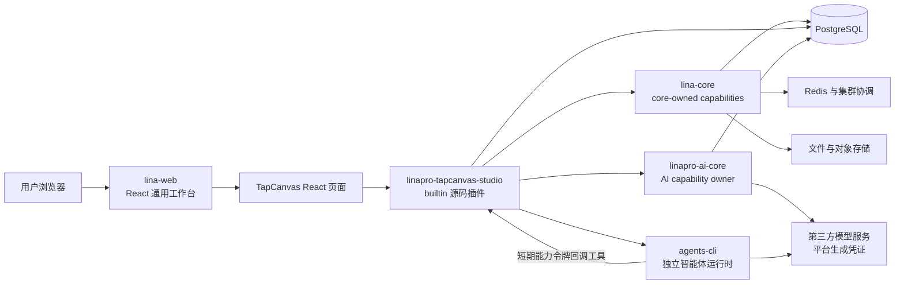
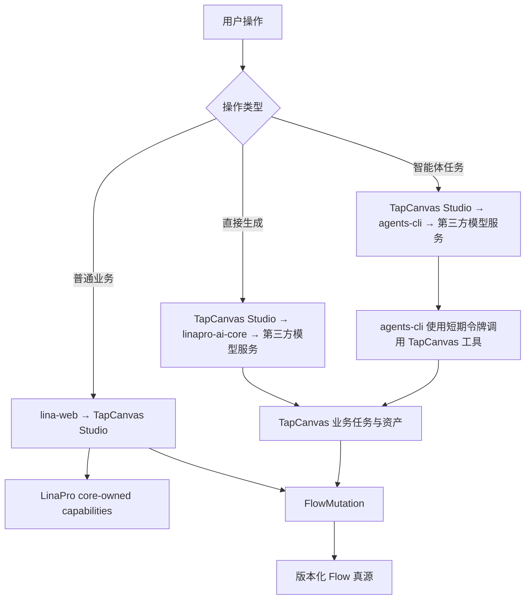

# TapCanvas 基于 LinaPro 的总架构设计

## 文档定位

本文定义 LinaPro 承载 TapCanvas 产品能力时的总架构、系统边界、长期有效的技术决策和后续设计拆分。目标读者是负责 LinaPro 框架贡献、官方插件、TapCanvas 迁移、智能体运行时、第三方模型接入和测试治理的开发者。

本文是总架构设计，不是单次实施计划。数据库字段、软删除策略、具体`HTTP API`、组件库、页面细节、性能数值和工期进入对应子设计，不在本文提前展开。

## 架构结论

目标系统采用“`React`通用工作台 + TapCanvas 内建源码插件 + LinaPro `Go`宿主 + 独立智能体运行时 + 第三方模型服务”的单一路径，不再部署自有`new-api`模型网关。

| 决策项 | 结论 |
| --- | --- |
| 平台宿主 | `apps/lina-core`继续作为通用`Go`宿主 |
| 默认工作台 | 新建`apps/lina-web`并替换`apps/lina-vben` |
| 前端技术栈 | 仓库维护的工作台、内建页面和源码插件统一使用`React` |
| TapCanvas 产品 | 使用`linapro-tapcanvas-studio`内建源码插件 |
| 插件分发 | `distribution: builtin` |
| AI 能力 owner | 使用 LinaPro 既有`linapro-ai-core`插件 |
| 智能体运行时 | `agents-cli`保持独立服务 |
| 模型接入 | `linapro-ai-core`与`agents-cli`分别直连第三方模型服务 |
| 身份与权限 | 统一使用 LinaPro 认证、用户、租户、RBAC 与数据权限 |
| 团队语义 | TapCanvas Team 映射为 LinaPro Tenant |
| 画布写入 | 前端与 Agent 统一使用版本化`FlowMutation` |
| 业务任务 | TapCanvas 插件拥有任务状态机与 Worker |
| 多语言 | 启用`zh-CN`与`en-US`，英文作为源内容 |
| 历史数据 | 不迁移，不保留旧模型兼容逻辑 |
| Hono 运行时 | 迁移完成后整体删除，不保留双轨 |
| 商业能力 | 首期不迁移，记录为后续独立插件工作流 |

## 设计原则

### 宿主保持通用

`apps/lina-core`只拥有认证、用户、租户、权限、数据权限、配置、文件、存储、缓存、锁、定时任务、插件治理和其他通用能力。宿主不得感知无限画布、分镜、生成任务、交付验收或 TapCanvas 工作流等产品语义。

工作台展示变化优先由`apps/lina-web`的适配层解决，不得为了 TapCanvas 页面字段、筛选项、路由或布局污染`lina-core`核心领域契约。

### 产品业务在插件内闭环

TapCanvas 的页面、业务`API`、数据表、业务任务、生成编排、Agents Bridge、配置、字典、错误码、i18n 资源和测试全部归属`linapro-tapcanvas-studio`。

插件内部按稳定领域拆分组件，但不把同一创作产品机械拆成多个互相依赖的业务插件。跨组件调用只通过明确契约，不访问其他组件的`DAO`、`DO`、`Entity`或内部实现。

### 平台能力复用既有 owner

TapCanvas 插件必须通过 LinaPro 公开能力访问租户、用户、权限、文件、存储、配置、缓存、锁、字典和定时任务。

`AI`属于`plugin-owned`能力，既有 owner 是`linapro-ai-core`。TapCanvas 插件通过`linapro-ai-core/backend/cap/aicap`消费类型化 AI 能力，不得直接调用第三方模型服务或在自身内部重新实现模型供应商网关。

### 硬切换且不保留兼容层

目标系统不长期维护以下双轨：

- `Vue`工作台与`React`工作台并行运行。
- `Hono API`与`Go API`同时承载同一业务。
- TapCanvas Team 与 LinaPro Tenant 并存。
- TapCanvas JWT 与 LinaPro Token 并存。
- Prisma 与 GoFrame DAO 双写同一业务数据。
- 前端整份 Flow 保存与 Agent 独立 patch 并行写入。
- 旧`API`到新`API`的兼容转发层。
- 自建`new-api`网关与第三方模型服务并行运行。

迁移阶段可以分批交付，但每个业务能力在任一时刻只能有一个权威写入 owner。正式切换后必须删除旧路径。

## 目标架构

### 调用链

## 组件职责

### `lina-core`

`lina-core`负责：

- 认证、会话、用户、租户、RBAC 与数据权限。
- 文件中心、插件私有存储、配置、字典、缓存、锁和集群协调。
- 定时任务、审计、错误契约、i18n 和 OpenAPI 聚合。
- 源码插件与动态插件的发现、依赖、授权、路由和生命周期治理。

`lina-core`不负责：

- TapCanvas 项目、Flow、素材、分镜、生成任务或 Agents Bridge。
- 模型渠道、模型档位、供应商协议或业务生成队列。
- TapCanvas 页面状态、节点模型或工作流展示结构。

### `lina-web`

`lina-web`是通用`React`工作台，负责：

- 应用启动、布局、路由、标签页、主题和错误边界。
- LinaPro 登录、Token 刷新、用户上下文与租户切换。
- 动态菜单、按钮权限、系统管理页面和插件管理页面。
- 宿主 i18n、运行时配置、API 客户端与插件页面装配。
- 源码插件`React`页面和插槽的构建期发现与运行期路由装配。

`lina-web`不得包含 TapCanvas 领域状态、节点协议、生成编排或画布业务规则。

### `linapro-ai-core`

`linapro-ai-core`继续作为 LinaPro 的`AI`能力 owner，负责：

- 类型化文本、图片、音频、视频、视觉、文档和向量能力契约。
- 渠道端点、模型身份、档位、最小调用日志和 provider adapter。
- 使用受治理的 provider adapter 直连第三方模型服务。
- 返回类型化结果、受控资产引用或`ProviderOperationRef`。

`linapro-ai-core`不拥有 TapCanvas 业务任务、业务进度、重试、通知或资产归属。

### `linapro-tapcanvas-studio`

TapCanvas 内建插件负责：

- 无限画布、节点、边、分组、选择、视口和编辑体验。
- 项目、章节、镜头、Flow、版本与统一`FlowMutation`。
- 素材、角色、分镜、草稿、Memory 和产品资产元数据。
- 生成任务、执行记录、进度、重试、取消、通知和结果回填。
- Agents Bridge、短期能力令牌、远程工具和交付验收证据。
- TapCanvas 业务`API`、数据表、配置、字典、错误码和测试。

插件声明`distribution: builtin`，随产品编译、安装、启用和升级。它不出现在普通插件管理列表，也不提供日常安装、停用、卸载或手动升级入口。

插件必须在`plugin.yaml dependencies.plugins`中声明对`linapro-ai-core`兼容版本的硬依赖。目标产品交付必须同时包含并先装配`linapro-ai-core`；依赖缺失或版本不匹配时阻断 TapCanvas 插件装配，不允许回退为直连第三方模型服务。

### `agents-cli`

`agents-cli`保持独立服务，负责：

- 意图识别、证据规划、技能选择、工具执行和子代理协作。
- 使用独立限权服务凭证调用第三方 OpenAI 兼容模型服务。
- 使用单次运行的短期能力令牌调用 TapCanvas 受治理工具。
- 返回结构化事件、工具证据、诊断信息和最终结果。

`agents-cli`不持有 LinaPro 用户 Token，不直接访问 TapCanvas 数据库，也不绕过 TapCanvas 工具契约修改 Flow。

### 第三方模型服务

目标系统不部署`apps/new-api`。第三方模型服务是系统外部依赖，服务两类调用方：

- `linapro-ai-core`通过 provider adapter 调用，用于 LinaPro 内部业务插件的类型化 AI 能力。
- `agents-cli`通过 OpenAI 兼容协议调用，用于独立智能体运行时的模型推理。

两类调用方使用独立凭证、独立调用来源和独立审计标识。浏览器与 TapCanvas 插件不得获得第三方密钥，也不得绕过`linapro-ai-core`直接调用第三方模型服务。

## 契约边界

| 调用关系 | 契约 owner | 契约形态 | 关键约束 |
| --- | --- | --- | --- |
| `lina-web`→`lina-core` | LinaPro 宿主 | 宿主`HTTP API`与前端适配契约 | 不泄漏宿主内部模型 |
| `lina-web`→TapCanvas 插件 | TapCanvas 插件 | 插件`HTTP API`与自有`DTO` | 前端不引用后端源码 |
| TapCanvas 插件→`lina-core` | LinaPro 宿主 | `capability.Services`下的 core-owned 能力 | 不访问宿主`internal`实现 |
| TapCanvas 插件→`linapro-ai-core` | `linapro-ai-core` | `backend/cap/aicap`类型化契约 | 不使用弱类型`Invoke`网关 |
| TapCanvas 插件→`agents-cli` | `agents-cli` | 版本化运行与事件协议 | 请求携带事实和能力，不注入固定语义流程 |
| `agents-cli`→TapCanvas 插件 | TapCanvas 插件 | 版本化工具协议 | 每次运行使用短期能力令牌 |
| `agents-cli`→第三方模型服务 | 第三方服务 | OpenAI 兼容协议 | 使用独立限权服务凭证 |
| `linapro-ai-core`→第三方模型服务 | `linapro-ai-core`与第三方服务 | provider adapter 与供应商协议 | TapCanvas 不感知供应商协议或密钥 |

## React 工作台与插件 UI 边界

统一`React`是目标产品的硬约束：

- LinaPro 仓库维护的工作台、内建页面和官方源码插件嵌入页面必须使用`React`。
- 源码插件向工作台贡献标准`React`路由模块、页面组件和插槽组件。
- 动态插件若使用其他前端框架，只能通过`iframe`或新标签页等隔离页面运行。
- 非`React`运行时不得注入`lina-web`宿主 bundle。
- TapCanvas 不引入`Vue`/`React`微前端兼容层。

当前`.agents/rules/frontend-ui.md`和`.agents/rules/plugin.md`仍包含需要收敛的 LinaPro 上游前端约束。React 工作台子设计必须先把产品治理契约更新为 React 单栈和动态插件隔离，再开始实现。`lina-tapcanvas`不采用 OpenSpec，继承自上游的`openspec/`内容不进入产品执行链。

React 工作台子设计已确定宿主管理页面统一使用 Semi Design；TapCanvas 源码插件可保留 Mantine，但必须共享宿主 React 单例并限制插件样式作用域。总架构继续只约束`React`单栈、宿主通用性和插件页面边界。

## 身份、租户与权限

### 平台身份

- 浏览器只使用 LinaPro 登录、会话和 Token。
- 删除 TapCanvas JWT、登录验证码、GitHub 登录、手机登录、邮箱登录和密码体系。
- 删除`tap_token`、本地 JWT 解析和 TapCanvas 自有全局`401`处理。
- TapCanvas 插件从 LinaPro 请求上下文读取当前用户、租户、权限和数据权限。

### Team 到 Tenant

TapCanvas Team 直接映射为 LinaPro Tenant：

- `tenant_id`是所有业务数据的硬隔离边界。
- 租户内访问统一使用 LinaPro RBAC 与数据权限。
- `owner_id`保留用于创建归属、审计和“仅本人”数据权限投影。
- 不保留项目成员表、Team Store、邀请流程或 TapCanvas 自有共享权限模型。
- 查询在数据库阶段注入租户与数据权限条件，禁止先查询全量数据再在内存中过滤。
- 更新、删除、下载、执行和批量动作在操作前验证目标记录可见性。

### Agent 短期能力令牌

TapCanvas 插件为每次 Agent 运行签发短期能力令牌。令牌至少绑定：

- `run_id`、租户、用户、项目和 Flow。
- 允许调用的工具和资源范围。
- 签发时间、过期时间、唯一标识和最小审计信息。

工具调用必须同时验证令牌、运行状态、资源可见性和工具授权。令牌不得替代 LinaPro 登录 Token，也不得扩大签发时用户的数据权限。

## Flow 与画布一致性

### 单一权威写入

Flow 使用服务端权威的版本化写入模型。前端用户操作和 Agent 工具最终都提交同一`FlowMutation`契约，不再保留两套独立写入路径。

`FlowMutation`至少表达：

- `mutationId`：调用方生成的幂等键。
- `flowId`与`baseRevision`：目标 Flow 和调用方基于的版本。
- `operations`：类型化节点、边、分组或元数据操作。
- `actor`：由服务端上下文确定的用户或 Agent 运行身份。

服务端按`baseRevision`检测冲突，成功后产生新 revision。相同`mutationId`重复提交必须返回同一结果，不得重复执行。

### 快照与热状态

- Flow 快照用于加载、受控保存点和重建，不作为并发写入主协议。
- 节点位置、拖动、选择和视口等前端热状态与持久业务状态分离。
- 拖动热路径不得每帧触发网络请求、持久化、全量序列化或无界`O(N)`/`O(E)`派生。
- 冲突时前端保留本地未提交操作，并显示明确的刷新、重放或放弃选择，不静默覆盖。

## 数据、文件与存储

### 数据真源

- TapCanvas 业务表由`linapro-tapcanvas-studio`拥有并使用`PostgreSQL`持久化。
- 项目、Flow、章节、资产元数据、任务和执行记录是业务真源。
- 第三方模型服务只提供外部执行结果，不成为 TapCanvas 业务数据真源。
- 历史 Prisma schema 不进入迁移范围，不创建兼容字段或旧数据读取路径。
- 现有`new-api`渠道、日志和配置数据不迁移，目标环境在`linapro-ai-core`和`agents-cli`中重新配置第三方连接。

每张业务表的软删除、唯一约束、索引和时间字段由对应领域子设计按真实查询与生命周期决定，不在总架构中统一套用。

### `Files()`与`Storage()`

| 场景 | 使用能力 |
| --- | --- |
| 用户上传并需要在 LinaPro 文件中心管理的文件 | `Files().Upload` |
| 从请求接收文件中心 ID | `Files().EnsureVisible`后再执行 |
| TapCanvas 私有中间产物、导入临时文件或可重建对象 | 插件作用域`Storage()` |
| 私有对象需要进入文件中心 | `Files().CreateFromStorage` |
| 图片、音频、视频等最终业务资产 | 受控资产记录与文件引用，不返回无界 base64 |

插件不得保存 provider object key、本地绝对路径或带认证信息的临时供应商 URL 作为公开业务契约。

### 缓存与协调

- `PostgreSQL`与文件存储分别是所属业务数据和二进制资产的权威源。
- `Redis`只用于缓存、锁、事件、租约和可重建协调状态。
- 权限、租户、配置、字典和插件状态复用 LinaPro 启动期共享实例与集群失效机制。
- 权威写入成功后才能发布失效或事件。
- 集群模式不得只更新当前进程本地状态。
- 新增缓存必须在子设计中定义最大陈旧时间、失效触发、跨实例同步、故障行为和重建路径。

## 业务任务与异步执行

TapCanvas 的生成和智能体任务不是 LinaPro 定时任务。业务任务由`linapro-tapcanvas-studio`拥有：

- `PostgreSQL`保存任务状态机、业务归属、输入摘要、结果引用、重试次数和错误状态。
- 插件 Worker 负责领取、执行、续租、取消、超时和重试。
- `Redis`可以承载租约、唤醒和事件分发，但不得成为唯一任务真源。
- LinaPro `Job`只用于定时清理、超时扫描、补偿扫描或对账。
- 任务提交必须与持久调度记录可靠耦合，进程退出后能够重新发现未完成任务。

`linapro-ai-core`返回`ProviderOperationRef`时，TapCanvas 插件将其保存为渠道操作引用，并继续管理业务任务、轮询、通知和最终资产归属。

## Agents Bridge

智能体链路如下：

1. `lina-web`向 TapCanvas 插件提交智能体任务。
2. 插件验证用户、租户、项目、Flow 和数据权限，并创建业务任务。
3. 插件为该次运行签发短期能力令牌，注入事实性上下文、工具描述和交付契约。
4. `agents-cli`使用独立限权服务凭证调用第三方模型服务。
5. `agents-cli`使用短期能力令牌调用 TapCanvas 工具。
6. 所有画布修改进入统一`FlowMutation`。
7. 插件收集工具调用、资产、Flow revision 和任务状态，完成交付验收。
8. 前端通过事件订阅或有界轮询观察真实状态。

Agents Bridge 只负责权限、协议、事实注入、工具边界、trace 和交付验收，不固化意图路由、创作 SOP、固定 prompt 套餐或子代理顺序。

## 能力替换映射

| TapCanvas 现有能力 | 目标实现 |
| --- | --- |
| JWT、登录和会话 | LinaPro Auth 与 Middleware |
| 用户和管理员用户 | LinaPro User |
| Team 和成员 | LinaPro Tenant 与租户成员能力 |
| 角色和权限 | LinaPro RBAC 与数据权限 |
| 文件中心资产 | LinaPro`Files()` |
| 插件私有对象 | LinaPro`Storage()` |
| 系统与插件配置 | LinaPro Config 与插件配置 |
| Redis 缓存和锁 | LinaPro Cache、Lock 与 Coordination |
| BullMQ 业务任务 | TapCanvas 业务任务表与插件 Worker |
| 定时清理和补偿扫描 | LinaPro`Job` |
| 模型与媒体生成 | `linapro-ai-core → 第三方模型服务` |
| 智能体模型推理 | `agents-cli → 第三方模型服务` |
| Prisma ORM | 插件 SQL 与 GoFrame DAO |
| Hono/Zod HTTP 契约 | GoFrame API DTO、Controller 与`g.Meta` |
| Hono OpenAPI | LinaPro OpenAPI 聚合 |
| Hono 错误响应 | LinaPro`bizerr`与 i18n 错误契约 |

## Hono 模块处置矩阵

删除`apps/hono-api`前，所有现有模块必须进入以下唯一处置路径。

| 处置路径 | 现有模块 | 目标 |
| --- | --- | --- |
| LinaPro 平台替代 | `auth`、`user`、`user-admin`、`team` | 删除自有实现，使用 LinaPro 平台能力 |
| 迁入 TapCanvas 插件 | `project`、`project-admin`、`chapter`、`flow`、`asset`、`material`、`storyboard`、`draft`、`execution`、`task`、`memory`、`agents`、`apiKey` | 按领域迁入`linapro-tapcanvas-studio` |
| AI 能力层替代 | `ai`、`model`、`model-catalog`、`new-api-models`、`dreamina` | 收口到`linapro-ai-core → 第三方模型服务` |
| 拆分后迁移 | `observability`、`stats` | 平台观测复用 LinaPro；TapCanvas 业务指标进入插件 |
| 后续商业插件 | `billing`、`commerce`、`product`、`order`、`wechat-pay` | 首期不迁移，进入后续独立工作流 |
| 删除内部壳 | `internal`与 Nest/Hono 启动适配 | 仅迁移仍被目标领域需要的最小契约，其余删除 |

每个模块迁移子设计必须继续细化路由、数据表、调用方、测试和删除门禁。处置矩阵未完成或创作主链仍依赖后续商业模块时，不得删除 Hono 运行时。

## 剔除范围

### LinaPro 侧

React 工作台达到功能等价并通过验证后删除：

- `apps/lina-vben/`。
- Vben、Vue、Ant Design Vue、Pinia 和 VXE Table 运行依赖。
- Vue 页面、插槽注册器、构建配置、类型检查和测试配置。
- 依赖旧 Vue 页面结构的 E2E 页面对象与选择器。
- 绑定 Vben、Vue 和 Ant Design Vue 的开发规范与文档。

所有官方源码插件必须在硬切换前迁移为`React`页面，或明确从目标产品交付中移除。

### TapCanvas Web 侧

从`apps/web`迁移时删除：

- 自有认证、登录、Token、Team、成员和权限底座。
- 与 LinaPro 重复的应用壳、系统管理导航和管理页面。
- 对`apps/hono-api/src`协议源码的直接别名引用。
- 巨型`src/api/server.ts`请求层和 Hono 专属客户端。
- 前端整份 Flow 与 Agent patch 双写路径。

保留并重构无限画布、项目工作台、章节分镜、素材、生成执行和 AI 对话等产品能力。`apps/web`不能整仓原样复制，必须先剥离平台壳和后端源码耦合，再迁入插件前端。

### Hono API 侧

处置矩阵、数据模型、调用方和验证门禁全部完成后，删除：

- `apps/hono-api/`运行时、Nest 启动壳和 Hono-to-Express 适配器。
- TapCanvas JWT、中间件、验证码、用户、Team 和权限模型。
- Prisma 客户端和运行期自动建表逻辑。
- TapCanvas 自有通用 S3/RustFS、Redis 和 BullMQ 底座封装。
- Hono OpenAPI、部署入口和旧协议转发路径。

### `new-api`侧

目标系统不迁移`apps/new-api`。当`linapro-ai-core`和`agents-cli`都完成第三方模型服务直连并通过验证后，删除：

- `apps/new-api/`源码与独立管理前端。
- Docker Compose 中的`new-api`服务、健康检查和依赖关系。
- `NEW_API_*`等专属环境变量、内部地址和部署文档。
- Hono、Web 与 Agents Bridge 中针对自建`new-api`的模型目录和路由适配。

删除前必须确认第三方连接、模型身份、密钥、限额、审计和故障诊断均已在`linapro-ai-core`或`agents-cli`的明确 owner 边界内重新建立。

## 错误与故障边界

- 认证、租户、数据权限和工具授权缺失时必须 fail closed，不得放宽权限。
- `linapro-ai-core`缺失或版本不满足硬依赖时，阻断 TapCanvas 插件装配并报告依赖错误。
- 第三方模型服务不可用、限流或凭证失效时，直接生成和 Agent 模型推理返回结构化错误；项目、画布和资产基础操作继续可用。
- `agents-cli`不可用时，只阻断智能体任务，不阻断普通画布编辑和直接生成。
- Agent 短期令牌无效、过期或越权时拒绝工具调用，并记录脱敏审计事件。
- Flow revision 冲突必须返回显式冲突，不自动覆盖或静默重试写入。
- 已成功生成的真实资产不得因后处理、回填或交付验收失败被删除。
- 任务重试必须复用幂等键，禁止重复创建节点、资产或业务记录。
- 前端只展示真实任务、事件、执行和资产状态，不伪造中间进度。

## 性能边界

- 画布拖拽、缩放和选择保持前端热路径，不在每帧触发网络、持久化或全量派生。
- Flow mutation 使用有界操作集合；快照加载和保存具备大小、超时和版本边界。
- 列表、候选、聚合和批量接口必须分页、限量或异步处理。
- 数据库访问次数不得随返回行数、节点数或关联对象数线性增长。
- 关联数据使用投影查询、批量查询、集合化装配或受控缓存，禁止`N+1`。
- 工作台聚合和插件资源扫描不得形成前端逐项瀑布请求。
- 具体节点规模、并发任务数、接口延迟、查询次数和事件吞吐预算由对应子设计量化。

## i18n 边界

- `lina-web`继续遵守宿主`i18n.enabled`、`i18n.default`和`i18n.locales`配置。
- `linapro-tapcanvas-studio/plugin.yaml`声明`i18n.enabled: true`。
- 插件声明`en-US`与`zh-CN`，英文作为 UI、错误 fallback 和 API 文档源内容。
- 插件运行时语言包和`apidoc`资源保留在插件自己的`manifest/i18n/<locale>/`中。
- 宿主语言切换后，TapCanvas 菜单、路由和页面文案必须同步刷新。
- 调用端可见错误使用稳定`bizerr.Code`、`messageKey`、参数和英文 fallback。

## 后续设计拆分

本总架构不得直接转化为一个巨型实施计划。后续至少拆分以下设计：

| 子设计 | 主要交付 |
| --- | --- |
| React 工作台替换 | `lina-web`、React 插件运行时、管理页面、构建和治理规则 |
| TapCanvas 插件基础 | `builtin`清单、目录、依赖、租户、权限、i18n 和最小页面 |
| Flow 与画布写入 | Flow 数据模型、`FlowMutation`、revision、幂等、冲突和热状态 |
| 资产与生成任务 | `Files()`/`Storage()`、任务状态机、Worker、AI 能力和资产回填 |
| Agents Bridge | 运行协议、短期能力令牌、工具、事件、trace 和交付验收 |
| Hono 迁移与切换 | 模块逐项迁移、调用方切换、数据初始化和最终删除 |
| 商业能力后续工作流 | `billing`、`commerce`、`product`、`order`与`wechat-pay`独立插件设计 |

每个子设计必须独立说明范围、接口、数据权限、缓存、i18n、性能、测试、删除门禁和回滚方式。这里的回滚只表示恢复当前阶段代码或部署，不表示保留旧运行时兼容路径。

## 建议迁移顺序

1. 启用 LinaPro 框架贡献模式，并为 React 工作台创建正式变更设计。
2. 更新前端、插件 UI、构建和测试治理契约。
3. 建立`lina-web`并达到 LinaPro 平台功能等价。
4. 在产品仓库`apps/lina-plugins`中创建`linapro-tapcanvas-studio`最小`builtin`插件。
5. 完成项目、Flow、租户权限和统一`FlowMutation`垂直切片。
6. 迁移资产、文件、生成任务、Worker 和`linapro-ai-core`调用。
7. 迁移 Agents Bridge、短期能力令牌、工具协议和交付验收。
8. 按 Hono 处置矩阵逐领域迁移并切换唯一写入 owner。
9. 完成大画布、权限、并发、任务恢复和外部依赖故障验证。
10. 删除`apps/lina-vben`、TapCanvas`apps/hono-api`、`apps/new-api`和所有旧兼容路径。

## 验证门禁

### React 工作台

- 登录、退出、Token 刷新、会话过期和租户切换通过 E2E。
- 菜单、路由、按钮权限、管理页面和 i18n 达到功能等价。
- 源码插件页面、动态隔离页面和插件路由刷新通过验证。
- 生产 bundle 不包含 Vue、Vben 或第二套嵌入式前端运行时。

### TapCanvas 插件

- 所有读取和写入受`tenant_id`、当前用户和数据权限约束。
- 前端和 Agent 修改 Flow 均进入`FlowMutation`。
- revision 冲突、幂等重试和任务恢复具有自动化测试。
- 生成任务覆盖成功、失败、取消、超时、重试和后处理失败。
- 已生成资产在后处理失败时仍被保留和记录。
- Agent 工具覆盖短期令牌有效、过期、越权和资源不可见场景。
- 插件`zh-CN`与`en-US`核心路径通过 i18n 与 E2E 验证。

### 硬切换

- Hono 处置矩阵每个模块都有目标 owner、验证证据和删除结论。
- 仓库不存在 TapCanvas JWT、Team、Prisma 或 Hono 业务调用路径。
- 不存在同一业务同时写入旧存储和 GoFrame DAO 的路径。
- 所有正式 E2E 指向`lina-web`和 Go 插件`API`。
- `agents-cli`、`linapro-ai-core`或第三方模型服务不可用时返回可诊断错误。
- 目标构建和部署清单不包含`apps/new-api`、`new-api`容器或专属环境变量。
- 构建、测试和开发入口在 Windows、Linux 与 macOS 具有等价路径。

## LinaPro 治理影响

该方案包含框架级前端替换。项目根不存在`.contributing`时，不得修改`apps/lina-core`、`apps/lina-vben`和`hack`。实施前必须显式进入框架贡献模式。

`apps/lina-plugins`已转换为`lina-tapcanvas`产品仓库直接跟踪的普通目录。`linapro-tapcanvas-studio`、`linapro-ai-core`和其他产品插件变更在父仓库内实施、验证和提交，与宿主及工作台共享同一版本历史；不得重新引入插件子模块、嵌套`.git`或独立插件 fork。

实施期还必须：

- 更新`.agents/rules/frontend-ui.md`中的 Vue/Vben 专属规则。
- 在`.agents/rules/plugin.md`和 React 工作台设计中维护源码插件 React 契约与动态插件隔离契约。
- 评估并迁移所有官方源码插件前端。
- 同步维护`apps/lina-core/pkg/plugin/README.md`和`README.zh-CN.md`。
- 保持`lina-core`核心领域契约不受 TapCanvas 产品细节污染。
- 对构建、资源发现、测试和代码生成入口执行跨平台验证。

## 后续商业能力记录

首期明确不迁移以下模块，但不得遗忘或在 Hono 删除时静默丢失：

- `billing`
- `commerce`
- `product`
- `order`
- `wechat-pay`

后续工作流应以独立商业插件为候选边界，重新设计商品、订单、支付、计费、退款、对账、租户归属、权限、审计和合规要求。开始该工作流前必须先确认它们与 TapCanvas 创作主链的真实依赖；若存在硬依赖，应先拆除或建立稳定契约，再删除旧 Hono 模块。

## 参考依据

- LinaPro 项目定位与宿主边界：`AGENTS.md`。
- LinaPro 插件规则：`.agents/rules/plugin.md`。
- LinaPro 架构规则：`.agents/rules/architecture.md`。
- React 工作台插件 UI 边界：`docs/2026-07-11-react-workbench-replacement-design.md`。
- LinaPro 插件公开契约：`apps/lina-core/pkg/plugin/README.zh-CN.md`。
- TapCanvas 当前架构分析：`../TapCanvas/docs/TAPCANVAS_ARCHITECTURE_ANALYSIS.md`。
