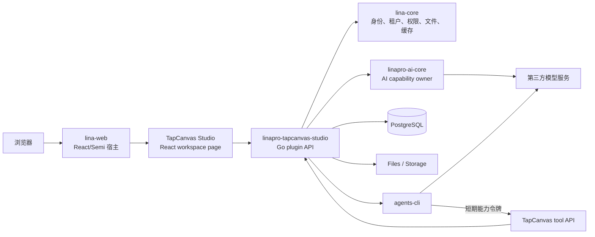

# TapCanvas Studio 内建插件详细设计

## 文档定位

本文定义把`../TapCanvas/apps/web`和仍需保留的 Hono 业务迁入`linapro-tapcanvas-studio`内建源码插件的可执行架构。目标读者是负责 LinaPro 插件、TapCanvas 画布、Go 后端、`linapro-ai-core`、`agents-cli`和测试治理的开发者。

本文只覆盖 TapCanvas 创作主链。React 工作台替换已经完成；商业计费、商品、订单、微信支付和历史数据迁移不在当前范围。实现以`docs/2026-07-15-tapcanvas-studio-migration-tasklist.md`为唯一执行清单。

## 结论

TapCanvas 采用一个`builtin`、`tenant_aware`的源码插件闭环承载创作业务。前端复用现有 React 画布，但删除独立应用壳、认证、Team、权限和商业页面；后端按领域硬切换到 GoFrame 插件；所有画布写入统一进入版本化`FlowMutation`；直接生成通过`linapro-ai-core`，智能体任务通过独立`agents-cli`和短期能力令牌完成。

| 决策项 | 结论 |
| --- | --- |
| 插件 ID | `linapro-tapcanvas-studio` |
| 插件类型 | `source` |
| 分发方式 | `builtin` |
| 租户范围 | `tenant_aware`，所有业务表强制`tenant_id` |
| 前端 | React 19，共享宿主 React 单例，页面 surface 为`workspace` |
| 画布 UI | 首次迁移保留 Mantine、React Flow 和 TapCanvas 主题；不得影响宿主 Semi 页面 |
| 宿主交互 | 只通过`@linapro/plugin-ui`和插件 HTTP API |
| 身份 | LinaPro 用户、Tenant、RBAC 和数据权限 |
| 数据 | 新建 PostgreSQL 插件表，不迁移 Prisma 历史数据 |
| Flow 写入 | `FlowMutation v1`、revision、幂等键和显式冲突 |
| AI | `linapro-ai-core/backend/cap/aicap`是唯一直接生成能力 owner |
| Agent | `agents-cli`独立服务；工具回调使用短期不透明能力令牌 |
| Hono | 按领域硬切换；迁移完成后删除运行时，不保留代理兼容层 |
| `new-api` | 不迁移，由第三方模型服务替代 |
| i18n | `en-US`和`zh-CN`，英文为源内容 |

## 当前代码事实

2026-07-15 的只读盘点表明，不能把`apps/web`原样作为插件页面长期保留：

- `apps/web/src`有 305 个文件，其中 290 个是 TypeScript/TSX，总计约 118,174 行。
- `TaskNode.tsx`为 8,675 行，`server.ts`为 6,669 行，`remoteRunner.ts`为 5,475 行，`Canvas.tsx`为 4,004 行，`store.ts`为 3,121 行。
- `App.tsx`同时装配独立应用壳、GitHub 登录、Team 积分、商业管理、项目入口、画布和 Agent 对话。
- `main.tsx`自行创建 React 根节点、Mantine Provider 和独立`401`拦截器，不适合嵌入 LinaPro 页面。
- `vite.config.ts`和`tsconfig.json`直接引用`apps/hono-api/src`的协议源码。
- Hono 业务约 30 个模块；`task`约 32,132 行，`asset`约 12,447 行，`agents`约 11,833 行。
- 当前 Flow 以整段 JSON 保存，`POST /flows/{id}/patch`没有 revision 和 mutation 幂等边界。
- 现有前端同时存在 canvas plan 和服务端 flow patch 两条写入路径。

因此迁移采用“机械复制建立可追溯输入，再立即剥离和分域”的方式。复制不是架构完成态。

## 范围

### 当前范围

- 创建`linapro-tapcanvas-studio`完整源码插件结构。
- 迁移项目、章节、Flow、画布、素材、分镜、Memory、生成任务和 Agent 创作链。
- 删除 TapCanvas 自有认证、用户、Team、成员、邀请、权限和管理底座。
- 删除创作主链对 billing、commerce、product、order 和 wechat-pay 的依赖。
- 迁移 Hono 创作领域到 Go 插件，并切换唯一写入 owner。
- 接入`linapro-ai-core`和第三方模型服务。
- 接入`agents-cli`短期能力令牌与工具回调。
- 删除目标产品中的 Hono、Prisma、BullMQ 和`new-api`运行路径。

### 非当前范围

- 迁移旧 TapCanvas 数据。
- 保留旧 API、JWT、Team 或 Prisma 兼容层。
- 实现计费、套餐、充值、商品、订单或支付。
- 修改 LinaPro 认证、用户、租户、RBAC 或数据权限模型。
- 把 TapCanvas 领域字段加入`lina-core`。
- 让浏览器或 TapCanvas 插件直接持有第三方模型密钥。

## 目标拓扑



浏览器只携带 LinaPro 会话。`agents-cli`不接收 LinaPro Token，不访问插件数据库，也不直接修改 Flow。

## 插件结构

```text
apps/lina-plugins/linapro-tapcanvas-studio/
├── plugin.yaml
├── plugin_embed.go
├── Makefile
├── go.mod
├── go.sum
├── backend/
│   ├── api/
│   │   ├── project/v1/
│   │   ├── chapter/v1/
│   │   ├── flow/v1/
│   │   ├── asset/v1/
│   │   ├── generation/v1/
│   │   └── agent/v1/
│   ├── internal/
│   │   ├── controller/
│   │   ├── dao/
│   │   ├── model/
│   │   └── service/
│   │       ├── generation/
│   │       └── agent/
│   └── plugin.go
├── frontend/
│   ├── plugin-ui.ts
│   ├── pages/
│   │   ├── project-entry.tsx
│   │   └── studio-workspace.tsx
│   └── tapcanvas/
│       ├── canvas/
│       ├── domain/
│       ├── projects/
│       ├── runner/
│       ├── storyboard/
│       ├── ui/
│       └── styles/
├── hack/
│   ├── config.yaml
│   └── tests/
├── manifest/
│   ├── config/
│   ├── i18n/
│   └── sql/
├── README.md
└── README.zh-CN.md
```

插件内部按领域拆分 service，但不创建多个互相依赖的 TapCanvas 插件。生成任务 Worker 和 Agent Worker 都属于业务编排，分别收敛在`backend/internal/service/generation/`和`backend/internal/service/agent/`，不得创建`backend/internal/worker/`。`backend/cap`只在将来确有其他插件需要消费 TapCanvas 稳定能力时创建；当前 Agent 工具使用受治理 HTTP 协议，不提前发布 Go 公共包。

## 插件清单

`plugin.yaml`使用以下固定边界：

| 字段 | 值 |
| --- | --- |
| `id` | `linapro-tapcanvas-studio` |
| `type` | `source` |
| `distribution` | `builtin` |
| `scope_nature` | `tenant_aware` |
| `supports_multi_tenant` | `true` |
| `default_install_mode` | `global` |
| `i18n.enabled` | `true` |
| `i18n.default` | `en-US` |
| `i18n.locales` | `en-US`、`zh-CN` |
| `dependencies.plugins` | `linapro-ai-core >=0.1.0 <0.2.0`硬依赖 |

当前`linapro-ai-core`仍是`managed`插件，而宿主会先收敛 builtin，再执行`plugin.autoEnable`。如果只把 Studio 改为 builtin，干净数据库启动会在 AI Core 安装前失败。目标产品必须在插件骨架阶段把`linapro-ai-core`同步改为`distribution: builtin`、`default_install_mode: global`，移除重复的`plugin.autoEnable`项，并验证 builtin 依赖排序先装配 AI Core、再装配 Studio。两者缺一或版本不兼容时都必须阻断启动，不能回退为直连模型服务。

菜单只提供 TapCanvas 项目入口和 Studio workspace。项目、章节和 Flow 通过资源 ID 路由或 query 参数进入同一个 workspace，不为每个内部面板创建宿主菜单。

建议权限：

| 权限 | 语义 |
| --- | --- |
| `tapcanvas:project:view` | 查看项目、章节和 Flow |
| `tapcanvas:project:create` | 创建项目 |
| `tapcanvas:project:update` | 修改项目和章节 |
| `tapcanvas:project:delete` | 删除项目 |
| `tapcanvas:flow:view` | 加载 Flow 和版本 |
| `tapcanvas:flow:mutate` | 提交`FlowMutation` |
| `tapcanvas:asset:view` | 查看和下载资产 |
| `tapcanvas:asset:manage` | 上传、关联和删除资产 |
| `tapcanvas:generation:run` | 创建、取消和重试生成任务 |
| `tapcanvas:agent:run` | 创建、取消和查看 Agent 运行 |

## 前端迁移

### 装配方式

`frontend/plugin-ui.ts`显式注册：

- `/tapcanvas/projects`，surface 为`page`，承载项目入口。
- `/tapcanvas/studio`，surface 为`workspace`，承载无限画布。

页面从`@linapro/plugin-ui`读取当前用户、Tenant、权限、语言和 API。API client统一调用`host.api.plugin("linapro-tapcanvas-studio", path, init)`或`pluginBlob`，不得绕过为宿主绝对 API。不得创建 React 根节点、Router、全局会话 store 或独立 Token 拦截器。

### 复制与剥离

第一次迁移机械复制`apps/web/src`和必要静态资源到`frontend/tapcanvas`，随后在同一阶段执行删除清单：

- 删除`main.tsx`、独立 Router、`GithubGate`、`auth/store`、`fetch401Interceptor`和登录回调。
- 删除 Account、Team、邀请、积分、充值、billing、commerce、product、order、wechat-pay 和旧 Stats 管理入口。
- 删除 Hono 协议源码 alias、`VITE_API_BASE`、GitHub OAuth 环境变量和 TapCanvas Token storage。
- 把`server.ts`拆为插件自有 API client；每个领域只暴露页面需要的 DTO。
- 把`App.tsx`拆为`studio-workspace.tsx`、workspace shell、画布工具条和按需面板。
- 将协议类型移入插件前端稳定目录，禁止从旧 Hono 源码导入。
- 只保留真实被 Studio 路由引用的静态资源和依赖。

### React 和 UI 依赖

- 插件不维护独立 React 依赖或 lockfile；Vite 使用宿主 React 19 和 ReactDOM 19。
- Mantine、React Flow、Tabler Icons、WebAV、Three 和其他实际可达依赖由`apps/lina-web/package.json`统一锁定，因为源码插件 UI 由宿主构建。
- Vite 对`react`、`react-dom`、Router、Query 和 Zustand 保持 dedupe；构建检查只能存在 React 19 主版本。
- TapCanvas 路由必须懒加载，Mantine、React Flow、Three、WebAV 和媒体编辑器不得进入宿主首屏 preload。
- Mantine Provider只包裹 TapCanvas workspace。CSS 变量绑定到`.tapcanvas-studio-root`，业务 CSS 不覆盖`body`、`:root`、`.semi-*`或 Lina token。
- workspace在`.tapcanvas-studio-root`内创建专用 portal root；Modal、Popover、Menu、Tooltip和 Notification等浮层必须挂载到该节点，不得默认逃逸到`document.body`。
- 宿主管理页继续使用 Semi Design；TapCanvas 创作工作区保留自身高密度视觉语言，不创建 Semi/Mantine 转发兼容层。

冻结时已从`../TapCanvas/apps/web/pnpm-lock.yaml`核对以下兼容基线；接入时仍需按真实 import 闭包增删，不得机械复制全部依赖：

| 依赖 | 冻结版本 | React 19 结论 |
| --- | --- | --- |
| Mantine Core/Hooks/Modals/Notifications | `7.17.8` | peer 支持`^18.x || ^19.x` |
| React Flow | `12.10.2` | peer 支持`>=17` |
| Tabler Icons React | `3.41.1` | 需要在宿主 React 19 下重新 typecheck |
| WebAV | `1.2.8` | 浏览器媒体能力需要独立 smoke |
| Framer Motion | `12.38.0` | 需要在宿主 React 19 下重新 typecheck |
| Three | `0.183.2` | 必须保持 lazy chunk |
| Zod | `3.25.76` | 不与宿主 DTO 直接耦合 |

宿主继续固定 React/ReactDOM`19.2.7`和 Zustand`5.0.14`。不得把来源仓 React`18.3.1`、Zustand`4.5.7`或独立 lockfile带入目标产品。

### 状态边界

| 状态 | owner |
| --- | --- |
| 用户、Tenant、权限、语言 | `lina-web`插件上下文 |
| 服务端查询 | TanStack Query，key 包含 tenant、project 和 flow |
| 当前画布图 | TapCanvas Zustand store |
| 拖动、选择、视口 | 前端热状态，不逐帧持久化 |
| 项目、Flow revision、任务 | Go 插件 API |
| 登录、Token 刷新 | LinaPro 宿主 |

Tenant 或 impersonation 变化时，卸载当前 Studio 状态，取消请求，清空 TapCanvas 查询和本地草稿，再重新进入目标 Tenant；禁止跨 Tenant 复用 Flow。

## 业务数据模型

所有业务表由插件 SQL 创建，使用前缀`tapcanvas_`。业务主键使用服务端生成的字符串 ID；`tenant_id`和用户 ID使用 LinaPro 数值 ID。公开响应的时间点使用 Unix 毫秒。

| 表 | 主要职责 | 软删除 | 关键索引 |
| --- | --- | --- | --- |
| `tapcanvas_projects` | 项目真源 | 是 | `(tenant_id, updated_at)`、`(tenant_id, owner_id, updated_at)` |
| `tapcanvas_chapters` | 项目章节 | 是 | `(tenant_id, project_id, sort_order)` |
| `tapcanvas_flows` | 当前 Flow 快照与 revision | 是 | `(tenant_id, project_id, updated_at)`、唯一`(tenant_id, id)` |
| `tapcanvas_flow_mutations` | 幂等写入日志 | 否 | 唯一`(tenant_id, flow_id, mutation_id)`、`(tenant_id, flow_id, revision)` |
| `tapcanvas_flow_versions` | 受控保存点 | 否 | `(tenant_id, flow_id, revision)` |
| `tapcanvas_assets` | 业务资产与 Lina 文件引用 | 是 | `(tenant_id, project_id, kind, updated_at)` |
| `tapcanvas_materials` | 角色、场景、道具和风格素材 | 是 | `(tenant_id, project_id, kind, updated_at)` |
| `tapcanvas_material_versions` | 素材版本和文件引用 | 否 | `(tenant_id, material_id, version_no)` |
| `tapcanvas_storyboard_shots` | 章节镜头、排序和连续性元数据 | 是 | `(tenant_id, chapter_id, sort_order)` |
| `tapcanvas_storyboard_shot_materials` | 镜头与素材版本引用 | 否 | 唯一`(tenant_id, shot_id, material_version_id)` |
| `tapcanvas_generation_tasks` | 生成任务真源 | 否 | `(tenant_id, status, available_at)`、`(project_id, updated_at)` |
| `tapcanvas_generation_attempts` | 执行尝试和 provider 引用 | 否 | `(tenant_id, task_id, attempt_no)` |
| `tapcanvas_agent_runs` | Agent 运行状态、trace 和交付证据 | 否 | `(tenant_id, project_id, updated_at)` |
| `tapcanvas_agent_tokens` | 短期能力令牌 hash、范围和撤销状态 | 否 | 唯一`token_hash`、`(run_id, expires_at)` |
| `tapcanvas_agent_events` | 脱敏的 Agent 事件流 | 否 | 唯一`(tenant_id, run_id, sequence)` |
| `tapcanvas_agent_tool_calls` | 工具调用幂等结果和审计 | 否 | 唯一`(tenant_id, run_id, tool_call_id)` |
| `tapcanvas_memory_entries` | 插件业务 Memory | 是 | `(tenant_id, project_id, scope_type, updated_at)` |

项目、章节、Flow、资产、素材、分镜镜头和 Memory 使用软删除，以支持业务恢复和引用完整性。素材版本、镜头素材引用、任务、attempt、mutation、Flow 版本、Agent run、token、event 和 tool call 是版本或审计记录，不允许软删除模拟状态变更；使用状态、撤销时间、保留期和清理任务治理。

子资源是否可见同时取决于自身和项目、章节等祖先未删除；任何详情、下载、生成和 Agent操作都必须验证祖先可见性。软删除项目不物理级联审计表，数据库外键禁止`ON DELETE CASCADE`删除 mutation、version、task、attempt、run、event或 tool call证据。

旧 storyboard render job统一映射到`tapcanvas_generation_tasks`，不再建立第二套渲染队列。时间线由镜头顺序、素材版本和生成资产投影得到。旧`draft`模块的提示建议与使用记录映射到 Memory 查询和使用元数据，不保留独立 Draft 表或 GET 写操作。

SQL 仅包含 DDL 和必要 Seed。菜单、权限和插件元数据由`plugin.yaml`治理；业务状态和类型的用户可见标签进入 LinaPro 字典与插件 i18n，不在前端硬编码。

数据库阶段各自维护一个迭代 SQL，不回写已通过阶段：`001-tapcanvas-project-chapter.sql`、`002-tapcanvas-flow.sql`、`003-tapcanvas-creative-assets.sql`、`004-tapcanvas-generation.sql`和`005-tapcanvas-agent.sql`。卸载脚本按依赖反序使用`995-tapcanvas-agent.sql`至`999-tapcanvas-project-chapter.sql`，确保先删除引用表、最后删除项目表。每个文件都必须可重复执行；Mock 数据单独放入`manifest/sql/mock-data/`。

## 身份、Tenant 和数据权限

### 请求上下文

Controller 和 service 通过启动期注入的`bizctxcap.Service`、`tenantcap.Service`和授权能力读取：

- 当前`user_id`、`tenant_id`和真实 acting user。
- 当前权限集合和数据范围。
- impersonation 与 platform bypass 状态。

Studio 是 Tenant 业务应用。普通业务 API 要求非零 Tenant；平台管理员必须先进入某个 Tenant，不能以 platform bypass 无界读取全部创作数据。

### 数据过滤

- 列表、搜索、导出和候选在数据库查询阶段添加`tenant_id`和数据范围。
- 详情、更新、删除、下载、生成、Agent 和批量动作先执行目标可见性检查。
- `owner_id`由服务端当前上下文写入，客户端不能指定或覆盖。
- 批量操作发现任一不可见目标时整体拒绝。
- 聚合统计使用相同过滤条件，不泄露其他 Tenant 或不可见项目数量。
- 依赖组织能力的数据范围在组织插件禁用时 fail closed，不自动放宽为全量。

## HTTP API

插件路由前缀为`/x/linapro-tapcanvas-studio/api/v1`。只读使用`GET`，创建资源或执行动作使用`POST`，更新使用`PUT`，删除使用`DELETE`。

核心资源：

| 方法 | 路径 | 说明 |
| --- | --- | --- |
| `GET` | `/projects` | 分页项目列表，最大 pageSize 100 |
| `POST` | `/projects` | 创建项目 |
| `GET` | `/projects/{projectId}` | 项目详情与最小聚合投影 |
| `PUT` | `/projects/{projectId}` | 更新项目 |
| `DELETE` | `/projects/{projectId}` | 软删除项目 |
| `GET` | `/projects/{projectId}/chapters` | 有界章节列表 |
| `POST` | `/projects/{projectId}/chapters` | 创建章节 |
| `PUT` | `/chapters/{chapterId}` | 更新章节 |
| `DELETE` | `/chapters/{chapterId}` | 软删除章节 |
| `GET` | `/projects/{projectId}/flows` | 分页 Flow 摘要 |
| `POST` | `/projects/{projectId}/flows` | 创建 Flow |
| `GET` | `/flows/{flowId}` | 当前快照、revision 和最小元数据 |
| `PUT` | `/flows/{flowId}` | 更新 Flow 名称等元数据，不更新图 |
| `DELETE` | `/flows/{flowId}` | 软删除 Flow |
| `POST` | `/flows/{flowId}/mutations` | 提交`FlowMutation v1` |
| `GET` | `/flows/{flowId}/versions` | 有界版本列表 |
| `POST` | `/flows/{flowId}/versions` | 创建受控保存点 |
| `GET` | `/projects/{projectId}/assets` | 分页资产列表 |
| `POST` | `/projects/{projectId}/assets` | 上传或关联 LinaPro 文件 |
| `GET` | `/assets/{assetId}` | 资产详情 |
| `GET` | `/assets/{assetId}/content` | 可见性校验后的文件流 |
| `DELETE` | `/assets/{assetId}` | 软删除资产 |
| `GET` | `/projects/{projectId}/materials` | 分页素材列表 |
| `POST` | `/projects/{projectId}/materials` | 创建素材和首个版本 |
| `POST` | `/materials/{materialId}/versions` | 创建素材版本 |
| `DELETE` | `/materials/{materialId}` | 软删除素材 |
| `GET` | `/chapters/{chapterId}/shots` | 有界分镜镜头列表 |
| `POST` | `/chapters/{chapterId}/shots` | 创建镜头 |
| `PUT` | `/shots/{shotId}` | 更新镜头与连续性元数据 |
| `DELETE` | `/shots/{shotId}` | 软删除镜头 |
| `POST` | `/chapters/{chapterId}/shots/reorder` | 原子重排镜头 |
| `PUT` | `/shots/{shotId}/materials` | 原子替换镜头素材版本引用 |
| `POST` | `/projects/{projectId}/memory/search` | 有界检索 Memory |
| `POST` | `/projects/{projectId}/memory` | 写入或更新受控 Memory 条目 |
| `GET` | `/generation-tasks` | 分页任务列表 |
| `POST` | `/generation-tasks` | 创建生成任务 |
| `GET` | `/generation-tasks/{taskId}` | 任务详情、attempt 和结果摘要 |
| `POST` | `/generation-tasks/{taskId}/cancel` | 请求取消 |
| `POST` | `/generation-tasks/{taskId}/retry` | 使用原幂等业务键重试 |
| `POST` | `/agent-runs` | 创建 Agent 运行 |
| `GET` | `/agent-runs/{runId}` | 运行和交付状态 |
| `GET` | `/agent-runs/{runId}/events` | 按 sequence 游标读取脱敏事件 |
| `POST` | `/agent-runs/{runId}/cancel` | 取消运行 |
| `POST` | `/agent-tools/execute` | `agents-cli`短期令牌工具回调 |
| `POST` | `/agent-service/runs/{runId}/tokens/rotate` | 仅服务凭证可用的 token 轮换 |

列表 DTO 直接提供页面所需名称、状态和摘要，不让前端逐行请求详情。关联对象一次性批量查询并内存装配；数据库调用次数不能随返回行数增长。`/agent-runs/{runId}/events`第一版使用`afterSequence + limit`有界轮询，不承诺 SSE；如后续增加 SSE，也必须从同一持久事件序列恢复，不能建立节点本地事件真源。

## `FlowMutation v1`

### 契约

```json
{
  "version": "v1",
  "mutationId": "client-generated-id",
  "baseRevision": 12,
  "operations": [
    {
      "type": "node.update",
      "nodeId": "node-id",
      "patch": {
        "position": { "x": 120, "y": 80 }
      }
    }
  ]
}
```

`actor`不在请求中接受，由服务端上下文或 Agent run 确定。v1 只允许固定结构操作：

- `node.add`、`node.update`、`node.delete`和`node.moveBatch`。
- `edge.add`、`edge.update`和`edge.delete`。
- `group.update`。
- `flow.metadata.update`。

不接受任意 JSON Patch path，不接受脚本、表达式或服务端字段覆盖。每个请求最多 200 个 operations，序列化后最大 1 MiB；单个 Flow 快照默认最大 20 MiB，具体配置可收紧但不能静默放宽。

### 写入算法

1. 在事务内按`tenant_id + flow_id`锁定当前 Flow 行。
2. 查询唯一键`tenant_id + flow_id + mutation_id`；存在且请求摘要一致时返回原结果，不一致时返回幂等键冲突。
3. 比较`baseRevision`；不一致返回结构化 revision conflict。
4. 验证所有操作、节点引用、边 handle、资产引用和数据权限。
5. 在内存对当前快照应用有界 operations。
6. 写入新快照并把 revision 加一。
7. 插入包含请求摘要、actor 和结果 revision 的 mutation 日志及必要版本元数据。
8. 事务提交后发布精确的 Flow revision 事件或缓存失效。

前端用户操作、生成结果回填和 Agent 工具都调用同一个 service。拖动期间只更新本地热状态，drag stop 后把同批位置变化合并为一个`node.moveBatch`。

冲突时前端保留本地未提交 operations，显示刷新、重放或放弃选择。禁止静默覆盖，禁止无上限自动重试。

## 资产与生成任务

- 用户上传文件通过`Files().Upload`，插件只保存 LinaPro file ID和受控资产元数据。
- 使用已有 file ID前调用`Files().EnsureVisible`。
- 私有中间产物使用插件`Storage()`；需要进入文件中心时调用`Files().CreateFromStorage`。
- 不在业务表保存本地绝对路径、provider 密钥、无期限供应商 URL 或无界 base64。
- 生成任务由 PostgreSQL 记录状态、输入摘要、幂等键、attempt、租约、结果和错误。
- Worker 使用有界批次领取任务，支持续租、取消、超时和重启恢复。
- Redis 只用于唤醒、租约协调或事件，不是任务真源。
- LinaPro Job只执行超时扫描、补偿、清理和对账。
- 供应商已经成功产生的资产必须先保存并记录；后处理失败不得删除或覆盖真实资产。

## `linapro-ai-core`接入

TapCanvas 插件在`plugin.yaml`和`go.mod`声明`linapro-ai-core`依赖，通过`backend/cap/aicap`类型化调用文本、图片、音频、视频和视觉能力。

- 不调用`linapro-ai-core`内部 service、DAO、provider adapter 或数据库。
- 不使用弱类型万能`Invoke`替代领域能力。
- Provider、endpoint、model、tier 和密钥由`linapro-ai-core`管理。
- TapCanvas 保存业务 task 和`ProviderOperationRef`，不复制 provider 调用日志。
- `linapro-ai-core`缺失或版本不兼容时阻断 builtin 插件装配。
- 外部模型不可用时生成任务显式失败；项目、Flow 和手工编辑继续可用。
- 浏览器模型选项来自`linapro-ai-core`的受治理能力投影，不回退到硬编码列表。

## `agents-cli`与短期能力令牌

### 运行链

1. 前端创建`tapcanvas_agent_runs`记录。
2. 插件验证 Tenant、用户、项目、Flow、权限和数据范围。
3. 插件生成 256-bit 随机不透明令牌，只保存 hash。
4. 令牌绑定`run_id`、Tenant、用户、项目、Flow、工具 allowlist、资源范围和过期时间，默认有效期 5 分钟。
5. 插件 Worker使用独立服务凭证调用`agents-cli /chat`，下发事实上下文、remote tool schema 和令牌。
6. 长任务只能由`agents-cli`使用同一服务凭证调用 token rotate API；插件重新验证活跃 run 和原 scope 后签发新 token并撤销旧 token，浏览器不能续期。
7. `agents-cli`使用令牌和稳定`toolCallId`调用`/agent-tools/execute`。
8. 工具 API同时验证 token hash、过期、撤销、run 状态、tool 名、资源范围和当前数据可见性。
9. 插件按`tenant_id + run_id + tool_call_id`保存请求摘要和结果；相同摘要重试返回原结果，不同摘要复用同一 ID时拒绝。
10. Flow 修改转换为`FlowMutation v1`，资产操作进入受治理 service。
11. 插件把脱敏 trace、tool evidence、Flow revision、资产引用和`deliveryVerification`写入有序 Agent event。
12. 完成、失败、取消或过期时撤销该 run 的全部未过期 token。

短期令牌不是 JWT，不是 LinaPro Token，也不包含第三方模型密钥。令牌只允许作为`Authorization: Bearer`发送到 TapCanvas 工具回调，不写日志、错误、事件载荷或数据库明文。`agents-cli`服务凭证来自宿主受控配置或 Secret，不进入插件表、前端包或仓库默认配置。

token 可在有效期内执行 allowlist 中的多个工具，因此“重放防护”由`toolCallId`幂等记录实现，而不是把 token 错误地设计成一次性。轮换只延长活跃 run 的调用窗口，不得扩大 Tenant、项目、Flow、工具或资源范围。

`agents-cli`不可用时只影响 Agent run。模型选择、意图理解、技能和子代理仍属于`agents-cli`；Go 插件只注入事实、安全硬约束、工具和交付证据，不实现关键词路由、固定 prompt 套餐或 case-specific 完成补丁。

## Hono 处置与硬切换

| Hono 领域 | 目标 owner | 处置 |
| --- | --- | --- |
| `auth`、`user`、`user-admin`、`team` | LinaPro | 删除，不迁移实现 |
| `project`、`project-admin`、`chapter` | TapCanvas 插件 | 迁为 Go service/API |
| `flow` | TapCanvas 插件 | 迁为`FlowMutation v1`，删除旧 patch |
| `asset`、`material`、`storyboard` | TapCanvas 插件 | 按资产、素材版本和分镜镜头迁移 |
| `draft` | TapCanvas 插件 Memory | 建议和使用记录映射为受控 Memory，不保留独立 Draft owner |
| `execution`、`task` | TapCanvas 插件 | 迁为 PostgreSQL 任务与 Worker |
| `memory` | TapCanvas 插件 | 迁为插件业务 Memory |
| `agents`、`apiKey` | TapCanvas 插件和`agents-cli` | 迁为 Agent run、短期令牌和受治理工具 |
| `ai`、`model`、`model-catalog`、`new-api-models`、`dreamina` | `linapro-ai-core` | 用类型化 AI 能力替代 |
| `observability`、`stats` | LinaPro + TapCanvas 插件 | 平台观测复用宿主，业务指标保留有界聚合 |
| `billing`、`commerce`、`product`、`order`、`wechat-pay` | 后续商业插件 | 当前删除调用方，不迁移 |
| `internal`、Nest/Hono 壳 | 无 | 调用方清零后删除 |

每个领域使用以下切换门禁：

1. 盘点路由、调用方、表、后台任务、测试和配置。
2. 在插件实现新 API、数据权限和测试。
3. 切换前端唯一调用方。
4. 运行该领域单元、Go 编译、E2E 和数据库幂等验证。
5. 删除旧调用、旧 schema 和旧任务入口。
6. 静态扫描证明创作主链不再依赖旧领域。

同一领域不得双写。允许迁移期间来源产品的不同领域分别由 Hono 或 Go 实现作对照，但目标产品中的单个资源只能有一个权威写入 owner；目标产品不启动 Hono 兼容代理。

## 缓存与集群一致性

- PostgreSQL 是项目、Flow、任务和 Agent run 的权威源；Lina Files/Storage 是二进制权威源。
- 第一版不缓存 Flow 快照，先避免一致性复杂度。
- 项目列表和只读投影若后续缓存，key 必须包含 Tenant、数据范围和 revision，最大陈旧时间需要独立记录。
- mutation、任务状态和 token 撤销在事务成功后失效或发布事件。
- `cluster.enabled=false`允许本地通知；`cluster.enabled=true`使用宿主 coordination/event/共享 revision，不允许只更新当前节点。
- 丢失事件时通过数据库 revision、TTL 或重新查询恢复。

## 性能预算

| 场景 | 门禁 |
| --- | --- |
| 项目、资产、任务列表 | 默认 20，最大 100；数据库侧过滤、排序、分页 |
| Flow 列表 | 只返回摘要，不返回图 JSON |
| Flow 加载 | 单请求返回快照与 revision，默认最大 20 MiB |
| Mutation | 最多 200 operations、1 MiB；一次事务和有界校验 |
| 拖动 | 每帧 0 网络、0 全量序列化、0 持久化 |
| 批量位置保存 | drag stop 合并一个`node.moveBatch` |
| 关联装配 | 固定次数批量查询，不按行查询 |
| Worker 领取 | 有界批次，使用索引和租约 |
| Agent 工具 | 每个调用显式 timeout、大小上限和审计 |
| 首屏 | TapCanvas、Mantine、React Flow、Three、WebAV 不进入宿主首屏 preload |

大画布验收至少覆盖 1,000 节点、2,000 边的加载、拖动、框选和 mutation 合并；具体延迟基线先测量再冻结，禁止伪造性能数值。

## i18n

- 插件声明`i18n.enabled: true`，只维护`en-US`和`zh-CN`。
- 英文是 API 文档、错误 fallback 和 UI 源内容。
- 运行时 UI、菜单、字典、错误和 apidoc 资源都保存在插件内。
- 翻译在渲染期求值，不在模块顶层调用`t()`。
- 迁移时删除硬编码 Team、积分、商业和旧登录文案。
- 核心 E2E 分别断言英文和中文真实文案，不使用双语正则冒充覆盖。

## 实施顺序

实现必须按依赖方向推进：

1. 冻结边界、基线和 builtin 插件骨架，并先解决 AI Core builtin 依赖顺序。
2. 复制 React 输入，移除独立应用壳、认证、Team、商业能力和宿主冲突样式。
3. 先交付项目、章节和`FlowMutation v1`，建立最小可写创作主链。
4. 再交付资产、素材版本、分镜和 Memory，随后交付生成任务与`linapro-ai-core`。
5. 在上述 API 可用后接入完整画布，禁止用临时 Hono 代理伪造阶段通过。
6. 最后接入 Agents Bridge、关闭剩余 Hono 调用、统一工具链并执行全量验收。

完整画布不得早于资产和生成任务阶段，否则媒体节点、模型选择、结果回填与错误恢复没有真实后端，无法形成可验收垂直切片。

## 验证策略

### 自动化

- 前端：React 19 typecheck、ESLint、Vitest、构建和 dependency graph。
- 插件 Go：service 单测、API contract、启动绑定、`go test ./... -count=1`和`make lint`。
- SQL：两次初始化、DAO 生成、卸载边界和索引审查。
- 数据权限：跨 Tenant、仅本人、不可见详情、批量拒绝、聚合不泄露。
- Flow：幂等、revision conflict、并发、无效操作、大小上限和 Agent/用户统一写入。
- Worker：领取、续租、取消、超时、重试、崩溃恢复和已生成资产保留。
- Agent token：有效、过期、轮换、撤销、错 run、错 Tenant、错 tool、资源不可见、tool call幂等冲突和日志脱敏。
- Hono 硬切换：旧路由调用、JWT、Team、Prisma、BullMQ 和`new-api`扫描为 0。

### E2E 与视觉

- 项目创建、章节、Flow 打开、编辑、保存、冲突和恢复。
- 素材上传、节点生成、任务失败、取消、重试和结果回填。
- Agent 对话、工具调用、Flow mutation、交付证据和 token 失败路径。
- Tenant 切换、impersonation、权限隐藏和跨 Tenant 拒绝。
- 中文、英文、暗色、亮色、1366px、桌面大屏和移动核心路径。
- 截图覆盖首次加载、面板、提交、筛选和异常路径，并进行图像审查。

## Hono 排除门禁

`../TapCanvas`是只读迁移来源，当前`lina-tapcanvas`目标仓库没有`apps/hono-api`。迁移不得复制、修改或删除来源仓 Hono 目录。目标产品只有在以下条件满足后，才能删除迁移过程中暂存的旧 client、协议 alias、环境变量和启动引用：

- 处置矩阵每个非商业模块都有目标 owner 和验证证据。
- 创作主链前端请求全部指向插件 API。
- 不存在 TapCanvas JWT、Team、Prisma 或 Hono 数据访问。
- 不存在 BullMQ 业务任务和旧 Flow patch 写入。
- `linapro-ai-core`与`agents-cli`均已使用第三方模型服务。
- Docker、CI、环境变量和文档不启动`new-api`或 Hono 服务；只读来源路径和迁移记录中的文字引用不计运行依赖。
- 全量 E2E、最终构建、OrbStack 运行和视觉审查通过。

如果未来目标仓库意外出现复制的 Hono 运行目录，删除该目录属于高风险硬切换动作，必须在对应门禁通过后单独获得用户确认。当前计划不包含删除`../TapCanvas`中的任何文件；切换前不建立兼容代理，切换后不保留隐藏开关。

## 影响评估

| 规则域 | 结论 |
| --- | --- |
| 架构 | TapCanvas 领域闭环在 builtin 插件；`lina-core`不感知画布业务 |
| API | 新增插件 REST API和`FlowMutation v1`；时间点统一 Unix 毫秒 |
| 数据库 | 新增插件 SQL和 DAO；不迁移旧数据 |
| 数据权限 | 所有读写显式接入 Tenant、角色数据范围和目标可见性 |
| 缓存 | 初版不缓存 Flow；任务和 token 以数据库为权威源 |
| i18n | 插件启用英文和简体中文，资源与宿主隔离 |
| 前端 | React 19 单例；TapCanvas workspace 懒加载且样式隔离 |
| 开发工具 | 需要把 TapCanvas 源码、依赖、测试和构建纳入现有 linactl 跨平台入口 |
| 测试 | 新增插件单测、E2E、截图、跨 Tenant、安全和恢复测试 |

## 参考依据

- 总架构：`docs/2026-07-11-tapcanvas-react-platform-migration-design.md`。
- React 工作台契约：`docs/2026-07-11-react-workbench-replacement-design.md`。
- 当前架构分析：`../TapCanvas/docs/TAPCANVAS_ARCHITECTURE_ANALYSIS.md`。
- LinaPro 规则：`AGENTS.md`、`.agents/rules/architecture.md`、`.agents/rules/plugin.md`、`.agents/rules/frontend-ui.md`、`.agents/rules/backend-go.md`、`.agents/rules/api-contract.md`、`.agents/rules/data-permission.md`、`.agents/rules/cache-consistency.md`、`.agents/rules/database.md`、`.agents/rules/i18n.md`和`.agents/rules/testing.md`。
